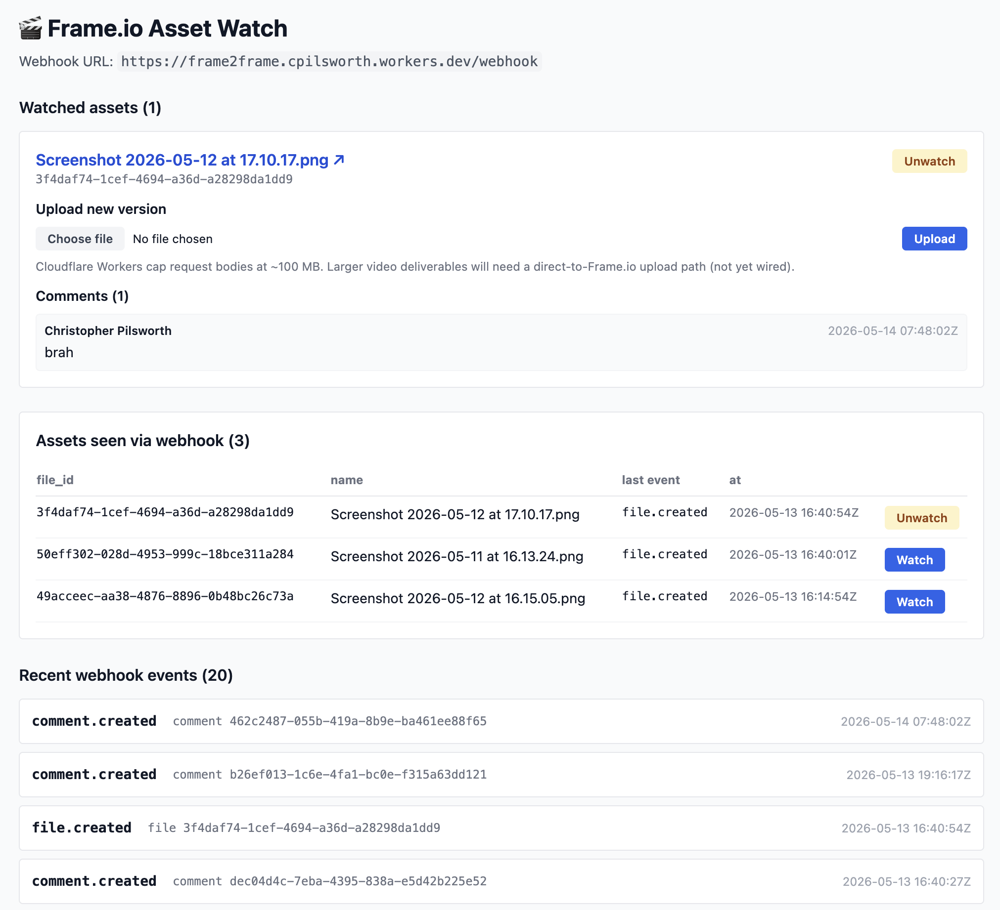
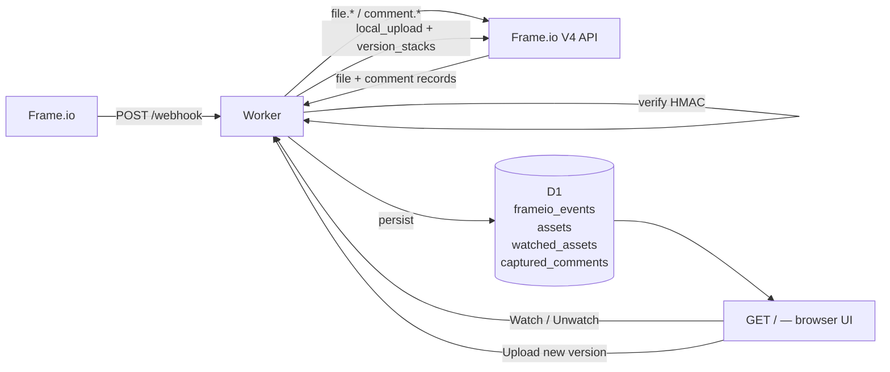

# Frame.io Asset Watch

A Cloudflare Workers app that listens to a single Frame.io V4 account via webhooks, lets you "watch" specific assets, captures all comments on watched assets to a local D1 database, and lets you upload new versions of a watched asset from your browser.

Built on Cloudflare Workers + D1 + Hono. Deployed at `frame2frame.cpilsworth.workers.dev`.

The architecture, scope, and design rationale for this codebase are documented in [docs/frame-io-asset-watch-poc.md](docs/frame-io-asset-watch-poc.md). It is a focused single-instance subset of the broader two-instance design at [docs/frame-io-sync-cloudflare.md](docs/frame-io-sync-cloudflare.md), which remains shelved.



## What it does



### Routes
All routes except `POST /webhook` require HTTP basic auth (see setup step 4); the webhook authenticates via its HMAC signature instead.

- `GET  /` — UI listing assets seen via webhook, with a Watch/Unwatch toggle and per-watched-asset panels showing comments + an upload form.
- `POST /webhook` — Frame.io webhook receiver. Verifies HMAC, persists the raw event, and calls back to Frame.io's API to resolve metadata for `file.*` events and to fetch comment details for `comment.*` events.
- `POST /watch/:fileId` — toggle the watched state for an asset. On first watch, backfills the asset's existing comments from Frame.io.
- `POST /assets/:fileId/versions` — multipart upload that stacks a new version onto the watched asset.

### Why the API callbacks
Frame.io V4 webhooks are intentionally thin — they carry only IDs (`account`, `resource`, `user`, `project`, `workspace`). To show a useful UI we have to call back:
- `GET /v4/accounts/{a}/files/{f}` after `file.*` events → caches name, media type, size, status, and the canonical `view_url` link in the `assets` table.
- `GET /v4/accounts/{a}/comments/{c}?include=owner` after `comment.*` events → resolves the comment's parent file, body text, timecode, and author. Only inserts into `captured_comments` if the parent file is watched.
- `GET /v4/accounts/{a}/files/{f}/comments?include=owner` on watch → backfills every existing comment so the panel isn't empty.

### New-version upload flow
Cloudflare Worker proxies bytes for now (capped ~100 MB by Workers' request body limit).
1. `GET file` → find the existing asset's `parent_id` (the folder it lives in).
2. `POST /accounts/{a}/folders/{folder_id}/files/local_upload` → response carries chunked S3 presigned PUT URLs.
3. PUT each chunk to its signed URL with `x-amz-acl: private`.
4. `POST /accounts/{a}/folders/{folder_id}/version_stacks` with `file_ids: [existing, new]` → stacks them as versions in the same folder.

If the existing asset is already inside a version stack (its `parent_id` is a stack rather than a folder), local_upload returns 404 and the UI surfaces a clear error — adding to an existing stack isn't yet wired up.

## Setup

### 1. Cloudflare resources
- `wrangler d1 create frame2frame` — note the database id and put it in [wrangler.toml](wrangler.toml).
- `npm run db:migrate:remote` — applies all migrations to the remote D1.

### 2. Frame.io webhook
Create a webhook in the Frame.io workspace settings pointing at `https://<your-worker>.workers.dev/webhook`. Subscribe to at least `file.created`, `file.updated`, `file.ready`, `file.deleted`, `comment.created`, `comment.updated`, `comment.deleted` — the deletion events drive the local tombstone/cleanup handling.

See the [Frame.io V4 webhook setup guide](https://next.developer.frame.io/platform/docs/guides/webhooks) for the UI walkthrough, the full event-subscription reference, and signature-header details.

Frame.io shows the signing secret **once on creation**. Store it:
```
wrangler secret put FRAMEIO_SIGNING_SECRET
```

### 3. Frame.io API token

**Recommended: Adobe IMS OAuth Server-to-Server.** Create a project in the [Adobe Developer Console](https://developer.adobe.com/console), add the Frame.io API, and choose an **OAuth Server-to-Server** credential. That gives you a client id + client secret good for long-lived, auto-refreshing access — no manual token rotation. Store them as:
```
wrangler secret put IMS_CLIENT_ID
wrangler secret put IMS_CLIENT_SECRET
```
Optionally override the requested scopes (defaults to `openid,AdobeID,read_organizations,frameio_api,offline_access`):
```
wrangler secret put IMS_SCOPES
```
[src/frameio/ims.ts](src/frameio/ims.ts) exchanges these for a bearer token via `client_credentials`, caching it in memory and refreshing a few minutes before it expires. `FrameIoClient` uses this automatically whenever both `IMS_CLIENT_ID` and `IMS_CLIENT_SECRET` are set.

**Fallback: static bearer token.** If IMS credentials aren't set, the app falls back to a plain bearer token from Frame.io (the developer portal or an IMS access token works). Stored as:
```
wrangler secret put FRAMEIO_TOKEN
```

If you can't get a working token through the Adobe Developer Console (auth scope mismatches, missing API entitlement, etc.), a quick fallback is to grab a short-lived user access token from the API Explorer — open any endpoint in the [Frame.io V4 API reference explorer](https://next.developer.frame.io/platform/v4/api-reference/accounts/index?explorer=true), sign in, and copy the bearer token it uses. It's tied to your user and expires in ~1 hour, but is sufficient for local testing and for the read-mostly flows this app does.

For convenience, [scripts/update-token.sh](scripts/update-token.sh) wraps the above with input validation and decodes the JWT to show `user_id` + expiry before uploading:
```bash
pbpaste | npm run token        # paste from clipboard (macOS)
npm run token < token.txt      # from file
npm run token                  # interactive — paste, then Ctrl-D
```

Note: short-lived IMS *user* access tokens (the API Explorer fallback above) expire in ~1 hour and need to be re-set; the OAuth Server-to-Server flow above doesn't have this problem and is the recommended path for production.

### 4. UI credentials
The browser UI (every route except `/webhook`) is protected by HTTP basic auth and fails closed (503) until a password is set:
```
wrangler secret put UI_PASSWORD    # required
wrangler secret put UI_USERNAME    # optional — defaults to "admin"
```

### 5. Deploy
```
npm run deploy
```

## Signature verification

Frame.io signs every delivery with HMAC SHA256 of `v0:<timestamp>:<body>`, sent as `X-Frameio-Signature` (`v0=<hex>`) alongside `X-Frameio-Request-Timestamp`. [verify.ts](verify.ts) does a constant-time comparison and rejects timestamps older than 5 minutes to defend against replay attacks.

## Layout

```
main.ts                Hono app: routes, webhook handler, helper field extractors
verify.ts              HMAC SHA256 verification (reused as-is)
db.ts                  Debug log accessors (frameio_events table)
home.tsx               Server-rendered UI
src/env.ts             Env interface (DB, FRAMEIO_SIGNING_SECRET, FRAMEIO_TOKEN)
src/db/queries.ts      Typed accessors for assets / watched_assets / captured_comments
src/frameio/client.ts  V4 API client: getFile, getComment, listFileComments,
                       createLocalUpload, createVersionStack, putUploadChunk
src/upload.ts          Multipart upload handler (browser → worker → Frame.io)
migrations/            D1 schema migrations
scripts/sign-test.ts   Helper to compute a valid signature for local testing
docs/                  Background design docs (two-instance sync — shelved)
```

## D1 schema

| Table | Purpose |
|---|---|
| `frameio_events` | Raw webhook log — every verified event |
| `assets` | Cached file metadata resolved via API after `file.*` events |
| `watched_assets` | User-selected files; webhook handler captures comments for these |
| `captured_comments` | Resolved comment records (text, author, timecode) on watched files |

## Notes

- The `docs/frame-io-sync-cloudflare.md` file describes a two-instance bidirectional sync design that's currently out of scope. Single-instance behaviour is what this app actually implements.
- Field extraction across `data.X` / `data.attributes.X` / `data.relationships.X.data.id` paths is defensive — Frame.io V4 wraps responses in `data` and the exact field names are tracked in the docs but flagged with `TODO(v4-verify)` comments where unverified.
