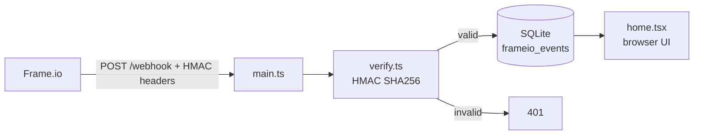

# Frame.io V4 Webhook Handler

A Val Town endpoint that receives, verifies, and logs [Frame.io V4 webhooks](https://next.developer.frame.io/platform/docs/guides/webhooks).

## What it does

- `POST /webhook` — receives Frame.io webhook deliveries
- `GET /` — shows the webhook URL and the 20 most recent events
- `GET /source` — link to the source code on Val Town

## Setup

1. **Register a webhook with Frame.io** using the URL shown on the home page (the `/webhook` path of this val). Choose the events you care about — see the [event reference](https://next.developer.frame.io/platform/docs/guides/webhooks#webhook-event-subscriptions).
2. **Save the signing secret** that Frame.io returns *only on creation*. Set it as the `FRAMEIO_SIGNING_SECRET` env var on this val.
3. Trigger a matching action in Frame.io. The event will appear on the home page.

## Signature verification

Frame.io signs every delivery with HMAC SHA256 of `v0:<timestamp>:<body>`, sent as the `X-Frameio-Signature` header (`v0=<hex>`) alongside `X-Frameio-Request-Timestamp`. `verify.ts` does a constant-time comparison and rejects timestamps older than 5 minutes to defend against replay attacks.

## Adding business logic

In `main.ts`, extend the `switch (payload.type)` block to react to events — for example, sync `file.ready` events to a DAM, forward `comment.created` to a ticket system, or post to Slack.

Note: Frame.io webhook payloads only include the resource ID. For richer data, [call the Frame.io API](https://next.developer.frame.io/platform/docs/) to look up the resource.

## Files

- `main.ts` — Hono HTTP entrypoint
- `verify.ts` — HMAC SHA256 signature verification
- `db.ts` — SQLite persistence of received events
- `home.tsx` — React server-rendered home page
- `scripts/sign-test.ts` — helper to compute a valid signature for local testing
