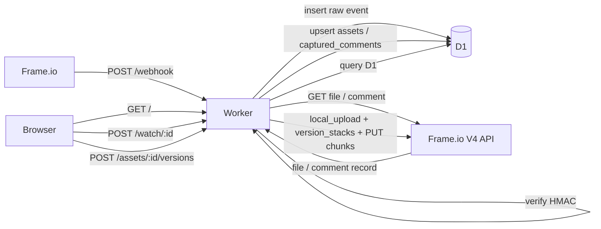
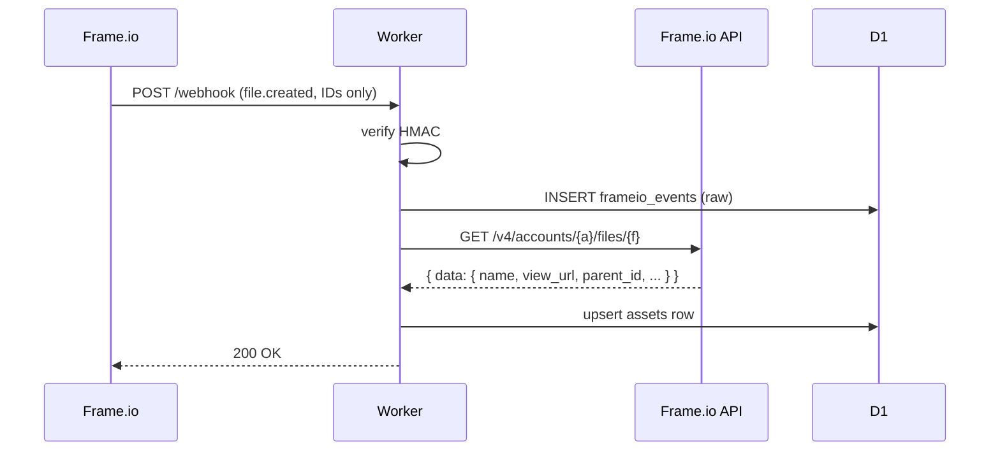
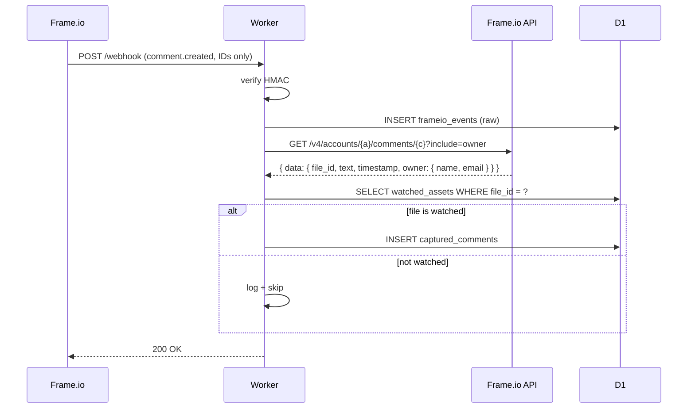
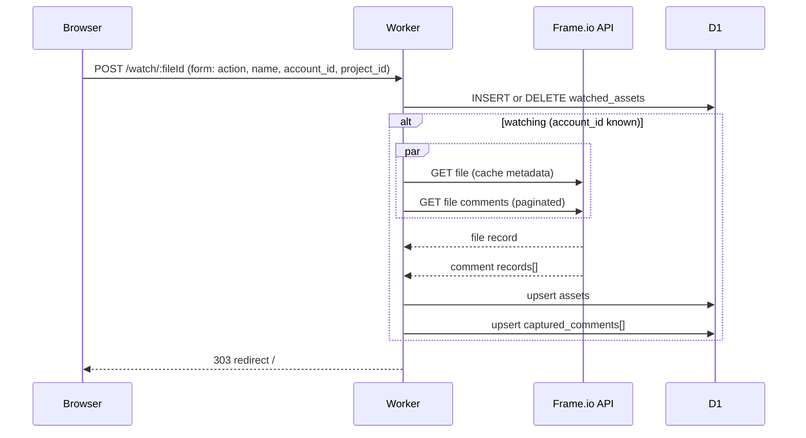
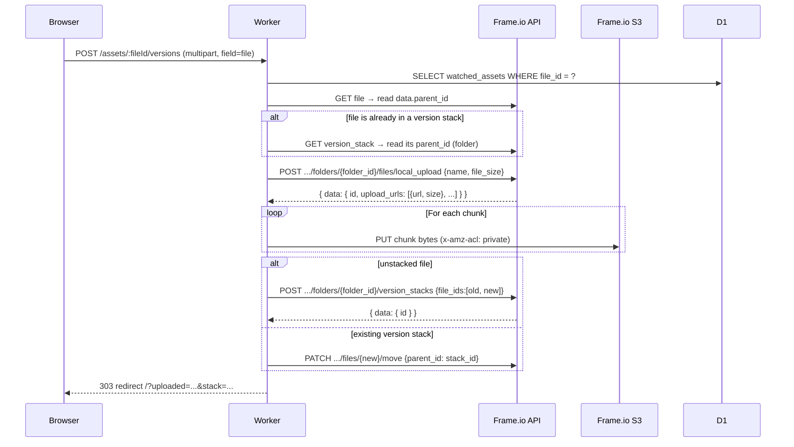

# Frame.io Asset Watch — PoC Design

| | |
|---|---|
| Status | Implemented PoC v0.1 |
| Owner | chrisp@adobe.com |
| Last updated | 14 May 2026 |
| Relationship to other designs | A small single-instance precursor to [frame-io-sync-cloudflare.md](frame-io-sync-cloudflare.md). Two-instance sync, custom actions, publish gating, and rate-limit choreography from that doc are **out of scope** here. |
| Deployed at | https://frame2frame.cpilsworth.workers.dev |

---

## 1. Executive summary

This is a small Cloudflare Workers + D1 application that listens to one Frame.io V4 account via a single webhook subscription, lets an operator "watch" individual assets via a browser UI, captures every comment on watched assets to D1, and lets them upload a new version of a watched asset directly from the browser.

The functional contract is intentionally minimal compared to the two-instance design:

- One Frame.io account, one bearer token, one webhook URL.
- No bidirectional sync — comments are captured, not echoed.
- No custom action or publish gating — uploads are direct, browser → worker → Frame.io.
- No queue, no Durable Object, no scheduled jobs — the worker is `fetch`-only.
- No multi-tenant pairing config — the single deployment serves a single account.

The PoC is enough to demonstrate the core integration shapes Frame.io V4 requires: HMAC webhook verification, the **webhook-then-API-callback** pattern (V4 webhooks carry only IDs), and the **local_upload + version_stacks** flow that V4 uses in place of a "POST new version" endpoint. Anything built later on top of these primitives can reuse the same client, schema, and field-extraction helpers.

## 2. Scope

### In scope
- HMAC SHA256 verification of inbound Frame.io webhooks ([verify.ts](../verify.ts)).
- Raw event log of every verified webhook (`frameio_events`).
- Resolution of `file.created` / `file.updated` / `file.ready` / `file.versioned` events into a cached `assets` row by calling `GET /v4/.../files/{id}`.
- Resolution of `comment.created` / `comment.updated` events into a `captured_comments` row by calling `GET /v4/.../comments/{id}?include=owner`, but **only when the comment's parent file is watched**.
- A `watched_assets` toggle exposed in the home page UI.
- On watch, backfill of all existing comments for the asset via `GET /v4/.../files/{id}/comments?include=owner&page_size=50` (paginated).
- A new-version upload form: browser file picker → worker proxies bytes → Frame.io `local_upload` + `version_stacks`.
- A server-rendered home page that shows assets, watched panels (with comments + upload form), and a recent-events panel.

### Out of scope
- Two Frame.io accounts; mirroring assets or comments across accounts.
- Custom actions / "Publish to client review" gating.
- Multi-pairing or multi-tenant configuration.
- Outbound comment forwarding to Slack / Jira / etc.
- Queue-based asynchronous processing, dead-letter handling, reconciliation jobs.
- Outbound API rate limiting via Durable Objects.
- Adding new versions onto an asset whose `parent_id` is already a version stack.
- Files larger than ~100 MB (Cloudflare Workers request body limit on paid plans).
- OAuth Server-to-Server credential exchange — the worker currently consumes a pre-issued bearer token from `FRAMEIO_TOKEN`.

## 3. Architecture overview

### 3.1 System context

Two logical systems:

- **Frame.io account** — the single V4 account this worker is wired to.
- **Worker** — one Cloudflare Workers application:
  - **Fetch handler** ([main.ts](../main.ts)): Hono router for `/`, `/webhook`, `/watch/:fileId`, `/assets/:fileId/versions`.
  - **D1 database**: schema below.
  - **Workers Secrets**: `FRAMEIO_SIGNING_SECRET`, `FRAMEIO_TOKEN`.

No queue, no Durable Object, no scheduled handler. The worker is stateless apart from D1 and the secrets.

### 3.2 Data flow



### 3.3 Trust boundaries

The worker holds two secrets:
- `FRAMEIO_SIGNING_SECRET` — verifies that POSTs to `/webhook` came from Frame.io.
- `FRAMEIO_TOKEN` — bearer used on outbound API calls. Treated as a confidential credential; never echoed to the UI or logs.

The browser is not authenticated. The home page and its mutating endpoints (`/watch/:fileId`, `/assets/:fileId/versions`) are wide-open in this PoC — acceptable on a single-operator deployment, not acceptable for production multi-user use.

## 4. Frame.io V4 primitives used

Confirmed against the V4 reference (https://next.developer.frame.io/platform/v4/api-reference/):

| Endpoint | Purpose |
|---|---|
| `POST /webhook` (inbound) | Receive webhook events for the account |
| `GET /v4/accounts/{a}/files/{f}` | Fetch file metadata after `file.*` events; reads `data.parent_id`, `data.view_url`, `data.name`, etc. |
| `GET /v4/accounts/{a}/comments/{c}?include=owner` | Fetch comment record after `comment.*` events; reads `data.file_id` (parent) + `data.owner.{name,email}` |
| `GET /v4/accounts/{a}/files/{f}/comments?include=owner&page_size=50` | Backfill existing comments on watch; cursor pagination via `links.next` |
| `POST /v4/accounts/{a}/folders/{folder_id}/files/local_upload` | Create a new file; returns chunked S3 presigned PUT URLs |
| `PUT <signed_url>` with `x-amz-acl: private` | Upload a chunk |
| `POST /v4/accounts/{a}/folders/{folder_id}/version_stacks` with `{file_ids: [old, new]}` | Stack the new file on top of the existing one |

All response bodies are wrapped in a top-level `data` object; the client and helpers unwrap consistently.

## 5. Detailed design

### 5.1 Authentication

A single static bearer token, set via:

```
wrangler secret put FRAMEIO_TOKEN
```

Or via the project's convenience script ([scripts/update-token.sh](../scripts/update-token.sh)), which decodes the JWT and prints `user_id` + computed expiry before piping to `wrangler`.

Two acceptable token sources:
1. **Adobe Developer Console** — an OAuth Server-to-Server client, but for this PoC we paste the access token directly instead of running the IMS exchange. Tokens last ~1 hour.
2. **API reference explorer** — open any endpoint at https://next.developer.frame.io/platform/v4/api-reference/, sign in, copy the bearer the explorer is using. Same ~1 hour lifetime, tied to the signed-in user rather than a technical account.

The worker calls every Frame.io endpoint with `Authorization: Bearer ${FRAMEIO_TOKEN}`. There's no token cache, no refresh-on-401 loop, no IMS round-trip. When the token expires, outbound calls 401 and surface to the UI / logs; the operator re-runs `npm run token` with a fresh value.

### 5.2 Webhook subscription

One webhook configured in Frame.io pointing at `https://<worker>.workers.dev/webhook`. Recommended event subscriptions:
- `file.created`, `file.updated`, `file.ready`, `file.versioned`
- `comment.created`, `comment.updated`

The signing secret Frame.io reveals **once on creation** is stored as `FRAMEIO_SIGNING_SECRET`.

### 5.3 D1 schema

Four tables across five migrations ([migrations/](../migrations/)):

```sql
CREATE TABLE frameio_events (             -- 0001 — raw verified-event log
  id INTEGER PRIMARY KEY AUTOINCREMENT,
  received_at TEXT NOT NULL DEFAULT (datetime('now')),
  event_type TEXT NOT NULL,
  resource_type TEXT, resource_id TEXT,
  account_id TEXT, workspace_id TEXT, project_id TEXT, user_id TEXT,
  payload TEXT NOT NULL
);

CREATE TABLE watched_assets (             -- 0003 — operator-selected files
  file_id TEXT PRIMARY KEY,
  name TEXT, account_id TEXT, workspace_id TEXT, project_id TEXT,
  watched_at TEXT NOT NULL DEFAULT (datetime('now'))
);

CREATE TABLE captured_comments (          -- 0003 — comments on watched files
  comment_id TEXT PRIMARY KEY,
  file_id TEXT NOT NULL,
  parent_id TEXT,
  author_name TEXT, author_email TEXT,
  text TEXT, timecode TEXT,
  received_at TEXT NOT NULL DEFAULT (datetime('now')),
  raw_payload TEXT NOT NULL
);
CREATE INDEX idx_captured_comments_file ON captured_comments(file_id, received_at DESC);

CREATE TABLE assets (                     -- 0004 / 0005 — cached file metadata
  file_id TEXT PRIMARY KEY,
  name TEXT,
  account_id TEXT, workspace_id TEXT, project_id TEXT, parent_folder_id TEXT,
  file_size INTEGER, media_type TEXT, status TEXT, view_url TEXT,
  resolved_at TEXT NOT NULL DEFAULT (datetime('now')),
  raw TEXT
);
```

Migration 0002 (the two-instance sync schema from the larger design) was created, then dropped by 0003 once we pivoted to the single-instance scope.

### 5.4 Routes

| Method | Path | Handler | Purpose |
|---|---|---|---|
| GET | `/` | [main.ts](../main.ts) | Server-rendered home page |
| POST | `/webhook` | [main.ts](../main.ts) | Receive + verify + record + resolve |
| POST | `/watch/:fileId` | [main.ts](../main.ts) | Toggle watched state; on watch, backfill comments + metadata |
| POST | `/assets/:fileId/versions` | [src/upload.ts](../src/upload.ts) | Multipart upload → new version |

### 5.5 Field extraction strategy

Frame.io V4 wraps responses in `data` and uses snake_case field names (`file_id`, `parent_id`, `view_url`, `media_type`). Some fields are only included with `?include=owner` etc.

Each extractor (`extractCommentRecord`, `extractFileMetadata` in [main.ts](../main.ts)) reads from the most likely `data.X` path with a small handful of fallbacks. Paths that proved necessary during PoC development are locked in; speculative `data.attributes.X` / `data.relationships.X.data.id` paths from earlier guessing have been removed.

## 6. Key flow sequences

### 6.1 File event (asset metadata cache)



The home page derives its **Assets seen via webhook** table from a join of `frameio_events` and `assets`. Names, links, and project_ids on the table appear as soon as `assets` is populated.

### 6.2 Comment on a watched file



The home page renders captured comments grouped per watched-asset panel, with author name (or email as fallback) and timecode.

### 6.3 Watch toggle (with backfill)



Both API calls run concurrently. If `FRAMEIO_TOKEN` is missing or the calls fail, the watch still succeeds but the panel is empty; new comments arriving via webhook still get captured.

### 6.4 New-version upload



**Failure modes handled:**
- `local_upload` failure → upload has not begun; surface the Frame.io error.
- Version-stack creation or move failure → new file is uploaded; redirect with `&stack_failed=1` flag so the operator knows to stack manually.

## 7. Operational considerations

### 7.1 Idempotency

Light-touch: most operations are upserts. `assets` uses `ON CONFLICT (file_id) DO UPDATE`. `captured_comments` uses `ON CONFLICT (comment_id) DO UPDATE`. `watched_assets` uses `ON CONFLICT (file_id) DO UPDATE`. Webhook retries from Frame.io therefore reconcile rather than duplicate.

`frameio_events` is append-only — duplicate webhook deliveries produce duplicate rows, intentional for forensics.

### 7.2 Token expiry

`FRAMEIO_TOKEN` is short-lived (~1 hour for IMS access tokens). When expired:
- `/webhook` continues to verify and persist events; only the API callback step fails.
- The UI continues to render. Asset names + watched panels will degrade for any event that arrived after expiry until the token is refreshed.
- Backfill on watch returns `error: "FRAMEIO_TOKEN not set"` from the helper.
- Upload returns HTTP 500 with detail.

Refresh via `npm run token` → paste fresh value.

### 7.3 Worker request body limit

Cloudflare Workers cap request bodies at ~100 MB (paid plan). The upload handler proxies bytes through the worker, so files bigger than that fail. The `upload_urls` Frame.io returns are S3 presigned PUTs — a future improvement is to return them to the browser and let it PUT directly, removing the worker from the byte path.

### 7.4 Observability

- `wrangler tail` for live logs. The worker logs:
  - `Frame.io webhook received: <type>`
  - `file event for {id}: getFile failed: ...` on API failures
  - `comment webhook: file {id} not in watched_assets; skipping`
  - `watch backfill {file_id}: inserted=N skipped=M`
- D1 itself is the operator dashboard: query `frameio_events`, `captured_comments`, etc. directly via `wrangler d1 execute frame2frame --remote --command "..."`.

### 7.5 Error handling

| Scenario | Behavior |
|---|---|
| Signature verification fails | 401, logged |
| Invalid JSON body | 400 |
| `FRAMEIO_TOKEN` not set | Webhook still accepted + logged; API callbacks skipped with a warning |
| Frame.io API 401 | Logged; surface up to the caller (UI or webhook ack) |
| Frame.io API 404 on file resolution | Logged; webhook still acked |
| Upload `local_upload` failure | UI surfaces the Frame.io error before any bytes are sent |
| Upload version-stack update failure | New file persists; UI redirected with `stack_failed=1` |

## 8. Setup

Summarised; see [README.md](../README.md) for full step-by-step.

1. `wrangler d1 create frame2frame` → set the id in [wrangler.toml](../wrangler.toml).
2. `npm run db:migrate:remote` → applies 0001–0005.
3. Create a Frame.io webhook pointing at `/webhook`; store the signing secret in `FRAMEIO_SIGNING_SECRET`.
4. Obtain a Frame.io bearer token (Developer Console or API reference explorer); store via `npm run token`.
5. `npm run deploy`.

## 9. File layout

```
main.ts                       Hono app, webhook handler, field extractors
verify.ts                     HMAC SHA256 (unchanged from the original skeleton)
db.ts                         frameio_events accessors
home.tsx                      Server-rendered UI
src/env.ts                    Env bindings + secrets
src/db/queries.ts             watched_assets / captured_comments / assets queries
src/frameio/client.ts         V4 API client (getFile, getComment, listFileComments,
                              createLocalUpload, createVersionStack, getVersionStack, moveFile, putUploadChunk)
src/upload.ts                 Multipart upload orchestration
migrations/0001..0005         D1 schema migrations
scripts/sign-test.ts          HMAC test helper
scripts/update-token.sh       Token refresh utility
```

## 10. Known limitations and future work

- **Token lifecycle**: short-lived bearer + manual refresh. Restoring the OAuth Server-to-Server flow from the deleted `src/frameio/ims.ts` would give the worker hands-off token rotation, at the cost of needing Developer Console credentials.
- **Direct-to-S3 upload**: move the bytes off the worker path by returning the presigned URLs to the browser. Removes the 100 MB cap.
- **Operator auth**: gate `/watch/:fileId` and `/assets/:fileId/versions` behind a token-based check or Cloudflare Access.
- **Pagination on the assets table**: currently capped at 50 rows from `listAssetsFromEvents`. Either add a cursor parameter or paginate in the UI.
- **Comment thread structure**: V4 exposes replies via `?include=replies`; the PoC stores `parent_id` as null. Adding replies would let the UI render threads.
- **Retention**: `frameio_events` grows unbounded. Adding a daily prune (Cron Trigger + retention column on `project_mapping`) is what the larger design recommends — currently absent.

## 11. Relationship to the parent design

This PoC is a strict subset of [frame-io-sync-cloudflare.md](frame-io-sync-cloudflare.md). The parent design's:

- Receiver + Consumer + DLQ + Reconciliation Workers → collapsed to a single fetch handler.
- Queue + DLQ → omitted (no async work pattern needed; everything fits in the request lifetime).
- Rate Limit Durable Object → omitted (token volume too low to need pacing).
- Mapping store (`file_mapping`, `comment_mapping`, `event_log`, `project_mapping`, `failed_events`) → reduced to `watched_assets` + `captured_comments` + `assets`.
- OAuth IMS + per-side credential split → reduced to a single bearer token.
- Custom action gating + attribution prefixes + bidirectional sync → entirely out of scope.

Anything from the parent design can be re-layered on top of this PoC without rewriting the existing modules — the V4 client, the field extractors, and the D1 patterns are deliberately compatible with the larger flow.

---

_End of document v0.1-poc._
