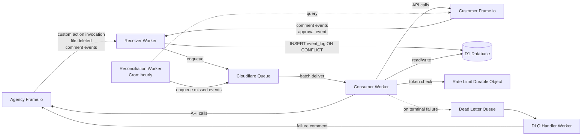
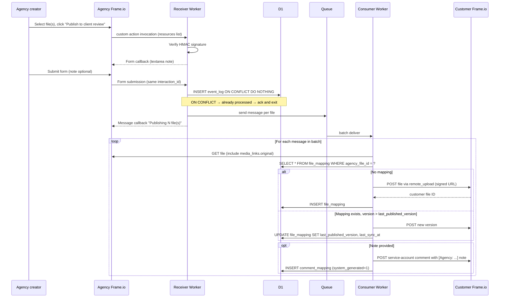
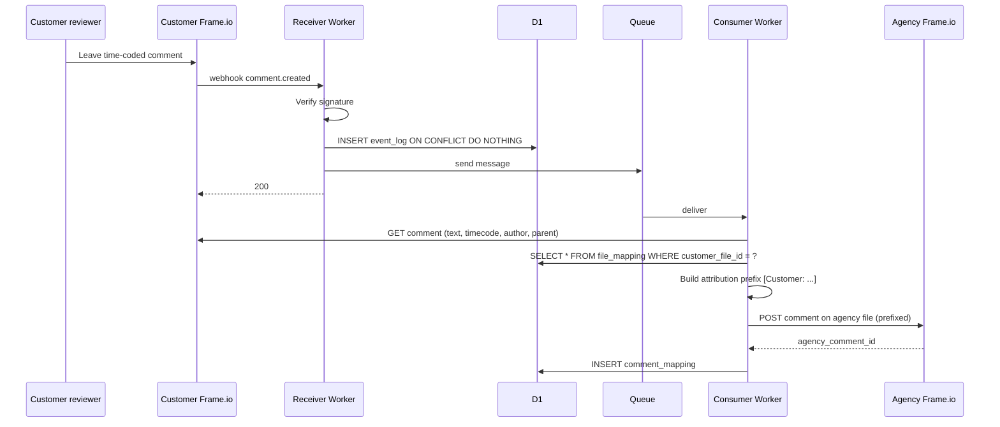
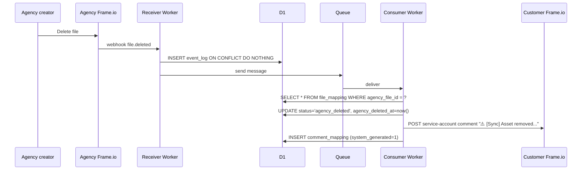
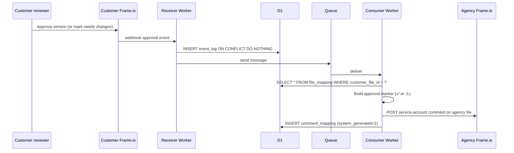

# Frame.io Two-Instance Sync — Cloudflare Variation

| | |
|---|---|
| Status | Draft v0.2-cloudflare |
| Owner | _to be assigned_ |
| Last updated | 13 May 2026 |
| Reviewers | Agency engineering, Customer IT, Solutions architecture |
| Relationship to base design | Variation of `frame-io-sync-design v0.2` substituting the orchestrator platform from Workfront Fusion to Cloudflare Workers + D1 + Queues. Functional design (gating, sync directions, attribution, deletion semantics, etc.) is unchanged. |

---

## 1. Executive summary

This variation of the Frame.io two-instance sync design substitutes the orchestrator implementation from **Workfront Fusion + Fusion Data Stores + internal-webhook scenario chaining** to **Cloudflare Workers + Cloudflare D1 + Cloudflare Queues**, while preserving the functional design and trust model of the base v0.2 document.

The functional contract is identical: explicit publish via a custom action on the agency side; bidirectional comment sync with attribution prefixes and explicit opt-in for agency-originated cross-boundary comments; one-way customer-to-agency completion and approval signal flow; persistent customer-side asset history with agency-deletion-as-marker; no cross-boundary user membership.

The platform substitution materially simplifies several mechanisms that were workarounds in the Fusion variant:

- **Two-way mapping lookups** stop needing denormalised mirror tables — D1 supports secondary indexes and foreign keys, so each entity has a single canonical table.
- **Idempotency dedup** becomes a native `UNIQUE` constraint with `INSERT … ON CONFLICT DO NOTHING`, rather than an add-or-fail pattern on a key-value store.
- **The receiver → worker handoff** becomes a real message queue with at-least-once delivery, dead-letter routing, and built-in retries, rather than internal-webhook scenario chaining.
- **Rate-limit token buckets** can use Durable Objects for strict per-side consistency without the contention dance.
- **Regional deployment** is configured once on the D1 primary location; Workers run at the edge globally.

The build-effort estimate is comparable to the Fusion variant in time but lower in workaround complexity. This variant is appropriate when the deployment context permits operating the orchestrator on Cloudflare's stack — either because the agency or customer organisation already runs on Cloudflare, or because Adobe-stack alignment is not a procurement constraint.

## 2. Background and motivation

Unchanged from base design. See `frame-io-sync-design v0.2` §2.

## 3. Scope

Unchanged from base design. See `frame-io-sync-design v0.2` §3.

## 4. Architecture overview

### 4.1 System context

Three logical systems:

- **Agency Frame.io** — Adobe Frame.io V4 account owned by the agency.
- **Customer Frame.io** — Adobe Frame.io V4 account owned by the customer.
- **Sync orchestrator** — A Cloudflare Workers application with the following components, all in one Cloudflare account:
  - **Receiver Worker** (HTTP-triggered): webhook and custom-action endpoint.
  - **Cloudflare Queue** (named `frameio-sync-events`): primary work queue with at-least-once delivery.
  - **Consumer Worker** (queue-triggered): processes enqueued events against Frame.io APIs and D1.
  - **Dead Letter Queue** (named `frameio-sync-events-dlq`): permanent failures after retry exhaustion.
  - **DLQ Handler Worker** (queue-triggered): posts failure comments via Frame.io and writes `failed_events` rows.
  - **Reconciliation Worker** (Cron Trigger, hourly): the comment-and-approval safety net.
  - **Rate Limit Durable Object** (one instance per Frame.io account): centralised token bucket for outbound API call pacing.
  - **D1 database** (one logical database): all mapping store tables.
  - **Workers Secrets**: OAuth credentials and webhook/custom-action signing secrets.
  - **KV namespace** (optional): cache for pairing config, hot-read at scale.

### 4.2 Data flow



The orchestrator is stateless except for D1, the rate-limit Durable Object, and the Queue's in-flight messages. Workers can scale horizontally; D1 handles concurrency via SQLite's WAL mode and Cloudflare's connection management.

### 4.3 Trust boundaries

Same as base design v0.2 §4.3. The Workers themselves run in Cloudflare's tenancy; OAuth credentials and webhook signing secrets are stored in Workers Secrets (encrypted at rest, scoped per Worker). Agency users are not members of the customer workspace; the orchestrator's service account is the sole cross-boundary author on each side.

## 5. Frame.io V4 primitives used

Same as base design v0.2 §5. The Frame.io side of the integration is unchanged.

## 6. Detailed design

### 6.1 Authentication

Both Frame.io accounts use **OAuth Server-to-Server credentials** via the Adobe Developer Console, as in v0.2 §6.1. The Workers application implements the `client_credentials` grant against the Adobe IMS token endpoint:

- Receiver and Consumer Workers each obtain access tokens on demand via `fetch()` against IMS, caching the token in a Durable Object keyed by side (`auth_agency`, `auth_customer`) until shortly before expiry.
- Token refresh is automatic on `401` from Frame.io: the Worker invalidates the cached token and re-fetches.
- `client_id`, `client_secret`, and the workspace webhook signing secrets are stored in Workers Secrets, referenced from the pairing config in D1 by name.

Single-tenant deployment: one credential pair per side, one Workers application, one D1 database, one set of secrets.

### 6.2 Webhook subscriptions

Same as base design v0.2 §6.2. Both webhook subscriptions point at the Receiver Worker's HTTP endpoint (`https://orchestrator.example.workers.dev/webhook/agency` and `…/webhook/customer`). The custom action POSTs to the same Worker on a third path (`…/custom-action/publish`). Path-based routing within the Worker dispatches to the appropriate handler.

### 6.3 Gating mechanism

Same as base design v0.2 §6.3. The `Publish to client review` custom action with multi-asset support (up to 100 resources per invocation) is the only publish trigger. Form callback for the optional client-facing note; message callback for the post-submit acknowledgement.

### 6.4 Mapping store schema (D1)

D1 is a serverless SQLite database with full SQL support including secondary indexes, `UNIQUE` constraints, and foreign keys. This collapses the Fusion variant's mirror-table pattern back to single canonical tables. The schema:

```sql
CREATE TABLE file_mapping (
  agency_file_id        TEXT PRIMARY KEY,
  customer_file_id      TEXT NOT NULL UNIQUE,
  agency_workspace_id   TEXT NOT NULL,
  customer_workspace_id TEXT NOT NULL,
  agency_project_id     TEXT NOT NULL,
  customer_project_id   TEXT NOT NULL,
  last_published_version INTEGER NOT NULL DEFAULT 1,
  status                TEXT NOT NULL DEFAULT 'active'
                        CHECK (status IN ('active','failed','agency_deleted')),
  agency_deleted_at     TEXT,
  created_at            TEXT NOT NULL,
  last_sync_at          TEXT NOT NULL
);
CREATE INDEX idx_file_mapping_customer ON file_mapping(customer_file_id);
CREATE INDEX idx_file_mapping_status   ON file_mapping(status);

CREATE TABLE comment_mapping (
  source_comment_id        TEXT PRIMARY KEY,
  target_comment_id        TEXT NOT NULL UNIQUE,
  sync_direction           TEXT NOT NULL
                           CHECK (sync_direction IN ('customer_to_agency','agency_to_customer')),
  agency_file_id           TEXT NOT NULL,
  parent_source_comment_id TEXT,
  original_author_name     TEXT,
  original_author_email    TEXT,
  system_generated         INTEGER NOT NULL DEFAULT 0,  -- boolean
  created_at               TEXT NOT NULL,
  FOREIGN KEY (agency_file_id) REFERENCES file_mapping(agency_file_id)
);
CREATE INDEX idx_comment_mapping_target ON comment_mapping(target_comment_id);
CREATE INDEX idx_comment_mapping_file   ON comment_mapping(agency_file_id);
CREATE INDEX idx_comment_mapping_email  ON comment_mapping(original_author_email);

CREATE TABLE event_log (
  event_id          TEXT PRIMARY KEY,  -- Frame.io event ID; UNIQUE serves as dedup primitive
  received_at       TEXT NOT NULL,
  source_account_id TEXT NOT NULL,
  event_type        TEXT NOT NULL,
  interaction_id    TEXT,
  resource_id       TEXT,
  processed_at      TEXT,
  outcome           TEXT
                    CHECK (outcome IN
                      ('success','skipped','failed','retrying','skipped_agency_deleted')),
  error_detail      TEXT,
  attempt_count     INTEGER NOT NULL DEFAULT 0
);
CREATE INDEX idx_event_log_outcome ON event_log(outcome, received_at);

CREATE TABLE project_mapping (
  pairing_id                       TEXT PRIMARY KEY,  -- 'default' for single-pairing
  agency_account_id                TEXT NOT NULL,
  agency_workspace_id              TEXT NOT NULL,
  agency_project_id                TEXT NOT NULL,
  customer_account_id              TEXT NOT NULL,
  customer_workspace_id            TEXT NOT NULL,
  customer_project_id              TEXT NOT NULL,
  customer_target_folder_id        TEXT NOT NULL,
  agency_publish_action_id         TEXT NOT NULL,
  agency_service_account_user_id   TEXT NOT NULL,
  customer_service_account_user_id TEXT NOT NULL,
  agency_signing_secret_name       TEXT NOT NULL,  -- Workers Secret reference
  customer_signing_secret_name     TEXT NOT NULL,
  agency_oauth_credentials_name    TEXT NOT NULL,
  customer_oauth_credentials_name  TEXT NOT NULL,
  customer_to_agency_prefix        TEXT NOT NULL,
  agency_to_customer_prefix        TEXT NOT NULL,
  approval_marker_template         TEXT NOT NULL,
  deletion_marker_template         TEXT NOT NULL,
  reconciliation_cadence_minutes   INTEGER NOT NULL DEFAULT 60,
  event_log_retention_days         INTEGER NOT NULL DEFAULT 90,
  status                           TEXT NOT NULL DEFAULT 'active'
                                   CHECK (status IN ('active','paused','disabled')),
  created_at                       TEXT NOT NULL,
  updated_at                       TEXT NOT NULL
);

CREATE TABLE failed_events (
  event_id        TEXT PRIMARY KEY,
  payload         TEXT NOT NULL,  -- JSON
  retry_count     INTEGER NOT NULL,
  first_failed_at TEXT NOT NULL,
  last_failed_at  TEXT NOT NULL,
  error_summary   TEXT
);
```

Pairing config is small and hot-read; it can optionally be cached in a Workers KV namespace to avoid a D1 read on every event. KV's eventual consistency is acceptable here because config changes are rare and operator-driven; a 60-second propagation delay is fine.

The integration writes no custom fields to Frame.io objects, as in v0.2.

## 7. Key flow sequences

Logical flows are unchanged from v0.2 §7. The diagrams below show the same flows with Cloudflare-specific participants.

### 7.1 New asset publication (agency → customer)



Multi-asset bursts are handled by the Queue's batch delivery to the Consumer Worker. By default the Consumer processes a batch serially within a single Worker invocation; if the workload demands parallel-per-file, the consumer can dispatch each file to `ctx.waitUntil()` blocks and rely on the rate-limit Durable Object for pacing.

### 7.2 New version on existing file

Same shape as §7.1's "Mapping exists" branch. The agency creator must re-invoke the custom action — new versions do not auto-sync from `file.versioned` events (we do not subscribe to that event on the agency side).

### 7.3 Customer comment creation



### 7.4 Customer comment update, completion, or deletion

Same logic as v0.2 §7.4: for each follow-up event, the Consumer Worker looks up the comment in `comment_mapping` (by `source_comment_id`), finds the paired `target_comment_id`, and issues the equivalent PATCH or DELETE on the agency side. Completion direction stays one-way (customer → agency only).

### 7.5 Reply handling and the agency-side reply auto-mirror

Same logic as v0.2 §7.5. Replies to mirrored customer comments on the agency side auto-mirror back to the customer's thread without needing the `>>client ` opt-in prefix.

### 7.6 File deletion on the agency side



Customer file persists. Subsequent customer comments on `agency_deleted` files are logged with outcome `skipped_agency_deleted` and not propagated.

### 7.7 Initial cutover

Greenfield deployment, as v0.2 §7.7. No backfill operation in scope.

### 7.8 Customer approval signal



### 7.9 Agency-originated cross-boundary comment

Same as v0.2 §7.9. The Consumer Worker detects either the `>>client ` prefix on a top-level body or a parent comment present in `comment_mapping` (with `sync_direction='customer_to_agency'`) and propagates with `[Agency: ...]` attribution.

## 8. Operational considerations

### 8.1 Webhook and custom-action signature verification

Same as v0.2 §8.1. The Receiver Worker reads the `X-Frameio-Request-Timestamp` and `X-Frameio-Signature` headers, computes HMAC SHA-256 over `v0:{timestamp}:{body}` using the signing secret retrieved from Workers Secrets, and compares (with the `v0=` prefix). Rejects on mismatch or timestamps outside the 5-minute replay window. Verification completes in microseconds; the 10-second custom-action timeout is comfortably met.

### 8.2 Idempotency

D1's `UNIQUE` constraint on `event_log.event_id` (the primary key) is the dedup primitive. The Receiver Worker performs:

```sql
INSERT INTO event_log (event_id, received_at, ...)
VALUES (?, ?, ...)
ON CONFLICT (event_id) DO NOTHING
RETURNING event_id;
```

If `RETURNING` yields a row, this is a new event — proceed to enqueue. If empty, the event has already been received and processed (or is in-flight); ack with 2xx and stop. This is race-safe at the database level without the read-then-write contention pattern the Fusion variant required.

Consumer-side idempotency is also more direct: before `INSERT`s into `file_mapping` or `comment_mapping`, the Consumer can use `INSERT … ON CONFLICT DO UPDATE` patterns where appropriate, or simple `SELECT` checks where the operation is non-idempotent (e.g., posting a Frame.io comment). The Frame.io API call for posting a comment is not idempotent at Frame.io's end, so the Consumer guards it with a `SELECT` from `comment_mapping` first; if a mapping already exists for the source comment, it skips.

### 8.3 Rate limits and multi-asset bursts

Frame.io V4 caps at 100 calls/minute/account-user. The orchestrator's service account is one user per side.

A **Rate Limit Durable Object** maintains a token-bucket per side (`rate_limit_agency`, `rate_limit_customer`). Each Consumer Worker, before making an outbound Frame.io API call:

1. Calls `RateLimit.check()` on the relevant Durable Object via its `idFromName()`-derived stub.
2. The Durable Object atomically checks available tokens; if available, decrements and returns success. If not, returns a recommended retry-after duration.
3. The Consumer either proceeds or sleeps and retries.

Token replenishment runs in the Durable Object itself via `alarm()` callbacks — every 600ms, the bucket adds one token (capping at the per-minute limit). This gives a steady ~100/minute sustained rate with smooth burst absorption.

Multi-asset bursts are processed by the Queue's batch delivery. Cloudflare Queues default to batch sizes of up to 100 messages per Consumer invocation; for an 80-file publish, the Consumer receives one batch and processes serially within a single Worker, throttling on the Durable Object as needed. End-to-end latency for an 80-file batch is ~5–8 minutes (dominated by the rate limit, not the platform).

Per-file error isolation: a single file failing inside a batch does not abort the rest. The Consumer Worker uses `ctx.waitUntil()` to ack-or-retry each message independently within the batch — successful ones are acked, failed ones are nacked back into the Queue with backoff. After Queue-level retry exhaustion (configurable, default 3 attempts with backoff), the message routes to the DLQ.

### 8.4 Signed URL handling

Same as v0.2 §8.4. 24-hour TTL on Frame.io's `media_links.original.download_url`; finished-deliverable workload doesn't stress the TTL; no byte proxying through the orchestrator. Cloudflare Workers have a 100ms-1s CPU time limit per request (paid plan) which is fine — the Worker hands off the URL to Frame.io's `remote_upload` endpoint and the actual byte fetch happens entirely between Frame.io's S3 and Frame.io's backend.

### 8.5 Comment attribution

Same as v0.2 §8.5. All cross-boundary comments authored by the service account on the receiving side, prefixed per `project_mapping` templates. `>>client ` opt-in for agency-originated top-level cross-boundary comments. Replies to mirrored customer comments auto-mirror.

### 8.6 Monitoring and alerting

Cloudflare's native observability is used:

- **Workers Analytics Engine** for high-cardinality metrics: per-event-type counters, latency histograms (p50/p95/p99), per-operation failure rates.
- **Workers Logs** for structured logs of every event processed (with sensitive data scrubbed — author emails are logged only as hashes for correlation).
- **Queue metrics** native in Cloudflare dashboard: backlog depth, in-flight count, DLQ depth.
- **D1 metrics**: query latency, error rate.
- **Custom alerts** routed via Cloudflare Notifications or external (PagerDuty, Slack):
  - Failure rate ≥5% over 5 minutes
  - DLQ depth > 10
  - Rate-limit hits ≥10/minute sustained
  - Queue backlog growing for >10 minutes (consumer falling behind)
  - Reconciliation `comments_resynced` >5 per run sustained (indicates webhook path failing)

### 8.7 Error scenarios

| Scenario | Handling |
|---|---|
| Signature verification fails | Reject with 401; log; alert on rate threshold |
| Mapping lookup miss on an update event | Nack message; Queue retries with backoff; after exhaustion → DLQ → operator inspection |
| 401 from Frame.io API | Invalidate cached IMS token; refresh; retry once; on second 401 → DLQ + alert (credential rotation needed) |
| 404 from Frame.io on previously-mapped resource | Mark `file_mapping.status='failed'`; surface in admin view |
| 429 from Frame.io API | Rate-limit Durable Object adapts; Consumer sleeps for retry-after duration |
| 5xx from Frame.io API | Queue retries with backoff (default 3 attempts, configurable), then DLQ |
| Agency deletes a published file | Mark `file_mapping.status='agency_deleted'`; post marker comment on customer file; customer file untouched |
| Customer comment on `agency_deleted` file | Log outcome `skipped_agency_deleted`; do not propagate |
| Consumer Worker terminal failure on a message | DLQ Handler Worker posts service-account failure comment on the relevant agency file; writes to `failed_events` |
| Frame.io custom action retry exhaustion | User sees Frame.io's "action failed" UI; no recovery path; user re-invokes |
| D1 transient failure | Worker retries the SQL operation with backoff; persistent failure raises a hard alert |

### 8.8 Asynchronous processing pattern

The integration uses **Cloudflare Queues** as the formal asynchronous boundary:

- **Receiver Worker** acks the webhook/custom-action immediately after dedup-insert and queue-send. Wall-clock receiver time is single-digit milliseconds plus the dedup INSERT round-trip (typically <50ms total).
- **Cloudflare Queue** holds messages with at-least-once delivery guarantees. Built-in retry with exponential backoff (configurable per Queue). After retry exhaustion, messages route to the DLQ.
- **Consumer Worker** is triggered by Queue batches. Each batch is processed within a single Worker invocation; per-message ack/nack is granular. Multiple Consumer instances scale horizontally based on backlog.
- **Dead Letter Queue + DLQ Handler Worker** catch permanent failures: the DLQ Handler posts the service-account failure comment on the relevant Frame.io file and writes the row to `failed_events` for operator inspection.

This is a more direct expression of the ack-and-enqueue pattern than the Fusion variant's internal-webhook scenario chaining. No polling. No latency floor.

### 8.9 Reconciliation scenario

A **Reconciliation Worker** is triggered hourly via Cloudflare Cron Triggers (configurable via `project_mapping.reconciliation_cadence_minutes`).

Scope of what it queries:

- Customer-side comments modified or created since `last_reconciliation_at - 1 hour` (1-hour overlap window for clock skew safety). For each, check `comment_mapping` (by `source_comment_id`); for unmapped comments on files where `file_mapping.status = 'active'`, send a synthetic event message to the Queue. The synthetic event ID is `recon:{comment_id}:{epoch_hour}` to keep reconciliation idempotent within a cadence window.
- Customer-side approval state changes within the same window. Same lookup-and-enqueue pattern.
- `event_log` rows in `outcome = 'retrying'` for longer than 30 minutes, or `outcome = 'failed'` younger than 24 hours: re-enqueue.

Belt-and-braces: the Consumer Worker also checks `comment_mapping` before acting on any reconciliation-originated event, catching races between original-event arrival and reconciliation re-attempt.

**Asymmetric resilience trade-off — important.** Same as v0.2 §8.9. Reconciliation recovers from missed customer-side events but cannot recover from missed publish-action invocations (Frame.io does not persist the user-clicked-but-not-delivered state). The mitigation is that publish failures are user-visible at click time.

## 9. Build options

### 9.1 Cloudflare Workers + D1 + Queues (this variation, recommended for this stack)

Native fit for the design's needs:

- **Workers** handle webhook receipt, queue consumption, and scheduled jobs with low cold-start latency and pay-per-request pricing.
- **D1** provides full SQL with proper indexes, `UNIQUE` constraints, and foreign keys — collapsing the Fusion variant's mirror-table denormalisation back to single tables.
- **Queues** provide native at-least-once delivery, retry with backoff, and DLQ routing — no scenario-chaining workaround.
- **Durable Objects** give the rate-limit token bucket strict single-writer semantics for free.
- **Workers Secrets** + **Workers KV** cover the credential and config-cache needs.
- **Cron Triggers** drive the Reconciliation Worker without an external scheduler.

**Pros:** Architectural fit for the design's needs is high. The Fusion variant's workarounds (mirror tables, add-or-fail dedup, internal-webhook chaining, polling-vs-chaining tension) don't apply. Cost scales linearly with traffic; for a single-pairing deployment with moderate volume, monthly cost is modest. Region selection on D1 covers the data-residency story cleanly. Developer experience is good: TypeScript or JavaScript, local dev with `wrangler`, edge deployment.

**Cons:** Requires Cloudflare in the deployment landscape. May be a procurement obstacle if the customer or agency organisation has standardised on AWS or Azure or has a "no new vendors" policy. No Adobe-ecosystem alignment claim available. Workers' CPU time limits (30s on paid plans) require careful handling of any single operation that could exceed it — though no operation in this design comes close.

### 9.2 Workfront Fusion + Fusion Data Stores (the v0.2 base variation)

See `frame-io-sync-design v0.2` §9.1. Preferred when:

- The agency or customer organisation already runs Fusion.
- Adobe-stack alignment is a procurement or political consideration.
- The team has Fusion expertise but no Cloudflare expertise.

### 9.3 Custom serverless on AWS / GCP / Azure

See `frame-io-sync-design v0.2` §9.2. Equivalent to the Cloudflare variation in architectural fit but with different per-cloud primitive names (SQS instead of Queues, DynamoDB or Aurora instead of D1, Lambda instead of Workers, EventBridge or Cloud Scheduler instead of Cron Triggers).

### 9.4 Decision criteria

| Criterion | Cloudflare | Fusion | AWS Serverless |
|---|---|---|---|
| Time to first pilot | ★★★ | ★★ | ★★ |
| Engineering effort | ★★★ | ★★ | ★★ |
| Operational complexity | ★★★ | ★★★ | ★★ |
| V4 feature coverage | ★★★ | ★★ | ★★★ |
| Cost at high volume | ★★★ | ★★ | ★★★ |
| Adobe stack alignment | ★ | ★★★ | ★★ |
| Debug and observability | ★★★ | ★★ | ★★★ |
| Dedup / two-way lookup fit | ★★★ | ★ | ★★★ |
| Regional residency control | ★★★ | ★★ | ★★★ |

**Recommendation:** Cloudflare for new builds where Adobe-stack alignment is not a binding constraint and where the operational landscape can accommodate a Cloudflare account. Fusion remains appropriate where Adobe alignment matters more than architectural fit.

## 10. Setup and configuration

### 10.1 One-time setup per Frame.io account

Steps 1–8 unchanged from v0.2 §10.1 (Developer Console project, OAuth Server-to-Server credentials, service account provisioning, webhook subscriptions, custom action registration on the agency side).

Cloudflare-specific provisioning:

9. Provision the Cloudflare account and Workers application.
10. Create the D1 database; run the schema migration (the `CREATE TABLE` statements in §6.4).
11. Create the Cloudflare Queue (`frameio-sync-events`) and DLQ (`frameio-sync-events-dlq`); configure retry and DLQ routing.
12. Create the Rate Limit Durable Object class binding in `wrangler.toml`.
13. Add Workers Secrets for each OAuth credential and webhook/action signing secret (`AGENCY_OAUTH_CLIENT_SECRET`, `CUSTOMER_OAUTH_CLIENT_SECRET`, `AGENCY_WEBHOOK_SECRET`, `CUSTOMER_WEBHOOK_SECRET`, `AGENCY_CUSTOM_ACTION_SECRET`).
14. (Optional) Create the Workers KV namespace for pairing config caching.
15. Configure Cron Triggers: hourly for the Reconciliation Worker, every 5 minutes for the retry sweep of `event_log` stuck rows.
16. Deploy via `wrangler deploy`.

### 10.2 Per-pairing configuration

Same logical fields as v0.2 §10.2; persisted as a row in the D1 `project_mapping` table per the schema in §6.4. Insert via SQL or via a small admin Worker endpoint. Secrets referenced by name only.

### 10.3 Cutover checklist

- [ ] OAuth Server-to-Server credentials validated on both sides
- [ ] Both webhook subscriptions created; signing secrets stored in Workers Secrets
- [ ] Agency-side custom action registered with multi-asset support; signing secret stored
- [ ] Both service accounts confirmed in their respective workspaces with the minimum required role
- [ ] D1 database created in the correct region; schema migrated; empty
- [ ] Queue and DLQ created; retry and routing configured
- [ ] Rate Limit Durable Object class bound
- [ ] Pairing config row inserted with correct identifiers, secret references, and templates
- [ ] Cron Triggers configured for Reconciliation and retry sweep
- [ ] Smoke test: publish one asset via the action; verify customer side; leave one customer comment; verify agency side; approve on customer side; verify agency-side service-account comment
- [ ] Cloudflare alerts configured for failure rate, DLQ depth, Queue backlog, rate-limit hits
- [ ] Runbook published

## 11. User experience

Unchanged from v0.2 §11. The user-facing behaviour of the integration is platform-independent.

## 12. Security and compliance

Most content unchanged from v0.2 §12. Cloudflare-specific variations:

### 12.1 Regional deployment

D1 supports primary-region selection at database creation. For EMEA customers with GDPR exposure, the D1 primary region should be set to an EU region (e.g., `weur` for Western Europe). Workers themselves run at the edge globally, but all D1 reads and writes route to the primary; the data of record never leaves the primary region.

Workers Secrets are stored encrypted in Cloudflare's global secrets infrastructure. For customers whose data residency commitments treat secrets as in-region data, this may require a documented exception or a self-hosted secrets layer (e.g., HashiCorp Vault in-region with the Worker reading at request time). For most enterprise deployments, Cloudflare's Workers Secrets posture is acceptable and is the deliberate trade-off for serverless operation.

Cloudflare Queues store messages in Cloudflare's global infrastructure. Message bodies for this integration contain Frame.io IDs and event metadata, not file content or comment text. Author names and emails are not in the Queue body — they live in D1 only. This keeps the Queue out of the GDPR data-subject scope.

The deployment region of the orchestrator is documented in §12 of this design as the canonical statement of where customer-related data resides.

### 12.2 GDPR subject rights

Same procedure as v0.2 §12.2. With D1's proper SQL, the admin operations are concise:

- **Right of access**:
  ```sql
  SELECT * FROM comment_mapping WHERE original_author_email = ?;
  ```
- **Right to erasure** (anonymisation):
  ```sql
  UPDATE comment_mapping
  SET original_author_name = '[redacted]',
      original_author_email = '[redacted]'
  WHERE original_author_email = ?;
  ```
  Followed by PATCHing the mirrored comment bodies on the agency side via Frame.io API to replace name/email content in the attribution prefix.
- **Right to rectification**: similar `UPDATE` plus re-PATCH.

The `idx_comment_mapping_email` index on `original_author_email` makes the lookup fast even at scale.

### 12.3 Retention

Same as v0.2 §12.3. A scheduled Worker (daily) deletes `event_log` rows older than `project_mapping.event_log_retention_days` for the relevant pairing. `file_mapping` and `comment_mapping` rows persist for the lifetime of the underlying Frame.io objects; they are not subject to event-log retention.

## 13. Open questions

Implementation-time verification items unchanged from v0.2 §13:

1. Exact V4 event name for customer-side approval state changes.
2. V4 Custom Actions beta-to-GA transition tracking.
3. Confirmation that V4 webhook delivery includes a stable event ID usable as dedup key.
4. Exact V4 endpoint paths and request shapes against the live reference.

Cloudflare-specific verification items:

5. Confirm Cloudflare Queues' maximum batch size and per-message size limits against the integration's typical message payload (Frame.io event JSON, typically <10 KB — well within limits).
6. Confirm D1's regional availability for the chosen deployment region; D1's regional support has expanded steadily and the chosen region should be checked at deployment time.
7. Confirm Workers Secrets' compatibility with the customer's compliance requirements (encryption at rest, key management posture).

## 14. Implementation roadmap

### Phase 1 — Pilot (estimated 2–4 weeks)

- Cloudflare Workers implementation of the design as specified in this document.
- Single pairing, greenfield deployment.
- Custom action with form and message callbacks, multi-asset support.
- Bidirectional comment sync with prefix-based opt-in and reply auto-mirror.
- Customer-to-agency approval sync via service-account comments.
- Agency-side deletion marker; no retraction.
- D1 schema with proper indexes; UNIQUE-constraint-based dedup.
- Cloudflare Queues with DLQ for the async work pattern; Cron Trigger for hourly reconciliation.
- Rate Limit Durable Object for outbound API pacing.
- Single deployment region per §12.
- Smoke-tested with non-production assets, then with one live customer engagement.

(This is roughly one to two weeks faster than the Fusion variant's Phase 1 estimate, reflecting the cleaner platform fit.)

### Phase 2 — Hardening (estimated 2 weeks)

- Production-grade observability via Workers Analytics Engine and Logs.
- Alert tuning and operator dashboards.
- Operator tooling: paused-state toggle on `project_mapping`; manual DLQ inspection and replay; GDPR subject-rights admin operations.
- Error-comment templates refined based on real failure patterns.
- Documentation and runbook completion.
- Beta-to-GA transition for V4 Custom Actions if it occurs in this window.

### Future considerations (not committed)

Same as v0.2 §14 Future considerations.

## 15. Appendix — V4 endpoints and contracts used

Same as v0.2 §15.

## Appendix B — Cloudflare resource summary

| Resource | Purpose |
|---|---|
| Workers application | Hosts Receiver, Consumer, DLQ Handler, Reconciliation, Retry Sweep Workers |
| D1 database | Mapping store (`file_mapping`, `comment_mapping`, `event_log`, `project_mapping`, `failed_events`) |
| Cloudflare Queue (`frameio-sync-events`) | Primary work queue, at-least-once delivery |
| Cloudflare Queue (`frameio-sync-events-dlq`) | Dead letter queue for permanent failures |
| Durable Object (`RateLimit`) | Per-side token bucket for outbound API pacing |
| Workers Secrets | OAuth client secrets, webhook signing secrets, custom action signing secret |
| Workers KV namespace (optional) | Pairing config cache for hot-read |
| Cron Triggers | Hourly Reconciliation Worker, 5-minutely retry sweep |

---

_End of document v0.2-cloudflare._