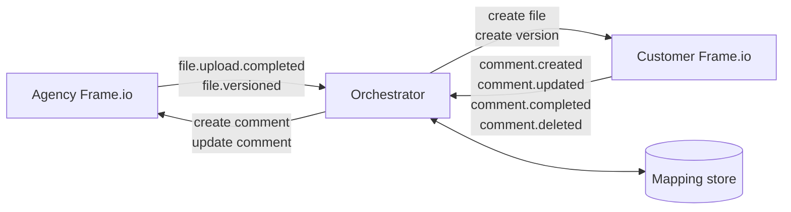
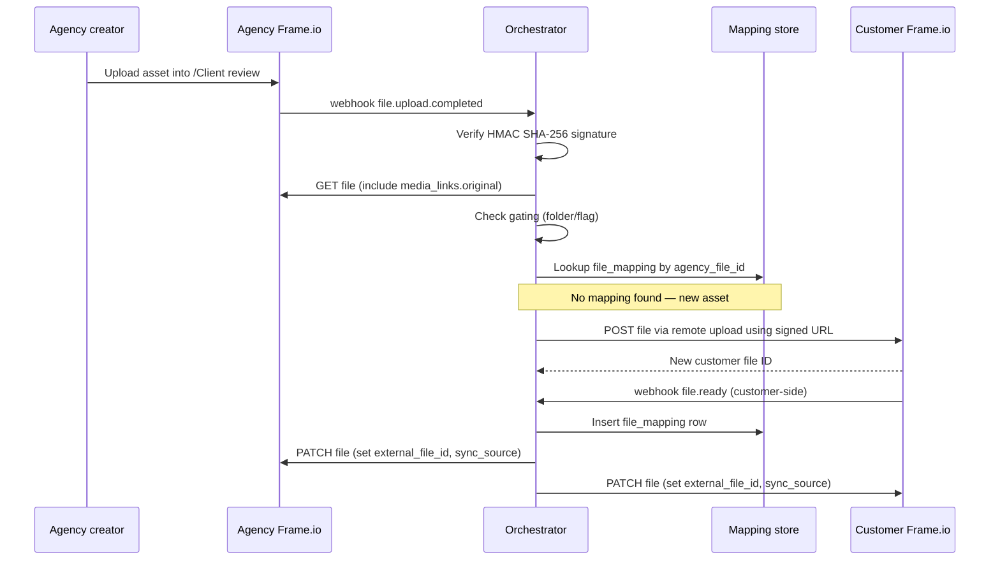
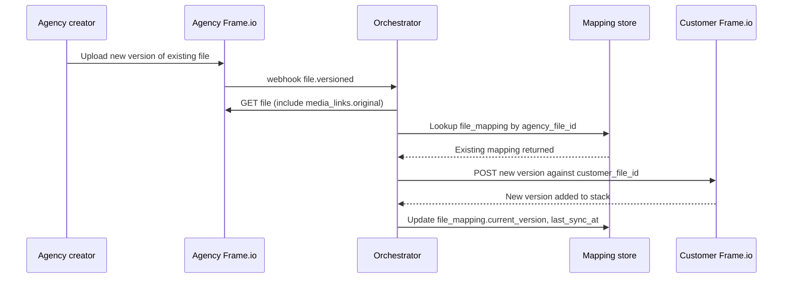
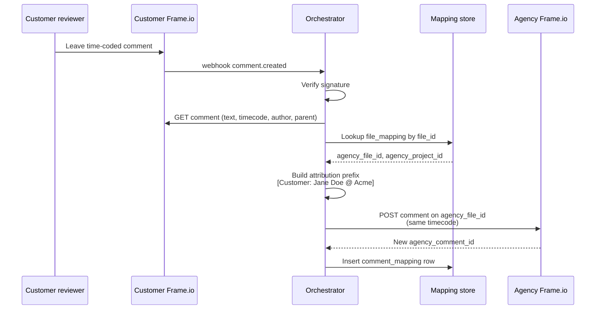

# Frame.io Two-Instance Sync — Detailed Design

| | |
|---|---|
| Status | Draft v0.1 |
| Owner | _to be assigned_ |
| Last updated | 12 May 2026 |
| Reviewers | Agency engineering, Customer IT, Solutions architecture |

---

## 1. Executive summary

This document describes an integration that synchronises selected assets and feedback between two Adobe Frame.io V4 instances: one operated by a creative agency, the other by the customer they serve. The agency instance is the canonical source for assets and internal collaboration. The customer instance is a curated review surface for stakeholder feedback. Assets and new versions flow one way (agency to customer); customer feedback flows one way back (customer to agency). Internal agency comments never reach the customer.

A small orchestrator between the two instances listens to Frame.io V4 webhooks, calls the V4 REST API to mirror the right state changes, and maintains an ID mapping store so each agency object remains linked to its customer twin. The recommended implementation is Workfront Fusion with a fallback to a serverless orchestrator where V4-specific behaviour cannot be expressed in the connector.

## 2. Background and motivation

Agencies and their clients have different operational needs from a review platform. The agency needs space for works-in-progress, raw assets, and candid internal critique. The client needs a clean review surface showing only what has been deemed ready, with full commenting and approval workflows, governed by their own IT and compliance regime. Running both groups in a single Frame.io workspace forces compromises on both sides — either internal mess leaks to the client, or the client has to be trained to ignore drafts.

Two separate Frame.io accounts (one agency-owned, one customer-owned) solve the trust-boundary problem cleanly but introduce a synchronisation gap: assets manually re-uploaded between accounts drift, and feedback collected in one cannot easily be acted on in the other. This integration closes that gap with a controlled, asymmetric sync.

## 3. Scope

### In scope

- Asset propagation from agency to customer for files inside a designated review surface.
- Version propagation: a new version uploaded against an existing file on the agency side appears as a new version in the customer file's version stack.
- Customer comment propagation to the agency side, including replies, edits, completion state, and deletion.
- Mapping store for file and comment relationships.
- Webhook signature verification, retry handling, audit logging.

### Out of scope

- Synchronisation of internal agency comments to the customer instance.
- Synchronisation of new asset variations from the customer instance to the agency instance (assets never flow upstream).
- Synchronisation of folder hierarchy beyond the designated review surface.
- Real-time co-editing or presence indicators.
- Identity federation between the two Adobe accounts (each account manages its own users).

### Non-goals

- Replacing the Frame.io UI on either side.
- Building a unified inbox or notification surface across both instances.

## 4. Architecture overview

### 4.1 System context

Three logical systems:

- **Agency Frame.io** — Adobe Frame.io V4 account owned by the agency. Contains all WIP, raw footage, internal collaboration, and the canonical version stack for every asset.
- **Customer Frame.io** — Adobe Frame.io V4 account owned by the customer. Contains only assets explicitly marked for review and the customer's feedback on them.
- **Sync orchestrator** — A small middleware component that listens to webhooks from both instances, calls both V4 APIs, and maintains a mapping store.

### 4.2 Data flow

Two unidirectional flows that share a mapping store:



The orchestrator is stateless except for its mapping store; webhooks can be processed in parallel and retried independently.

### 4.3 Trust boundaries

Each Frame.io account is a separate trust boundary. The orchestrator holds OAuth credentials for both, scoped to a service-account Adobe ID invited to the relevant workspace on each side with the minimum role needed (typically Editor or a custom role permitting file create, comment create/update/delete, and webhook administration). Credentials are stored in a secrets manager and rotated independently per side.

## 5. Frame.io V4 primitives used

| Primitive | Role in this design |
|---|---|
| Workspace | Webhook subscription scope. One review workspace per side. |
| Project | The unit of work. Agency and customer projects are paired 1:1 in the mapping store. |
| Folder | Organisational structure. A designated `/Client review` folder on the agency side acts as the gate for what propagates. |
| File | The asset itself. Carries `view_url`, `media_links.original`, version stack reference. |
| Version stack | Holds the iteration history of a file. The orchestrator appends to this rather than creating sibling files. |
| Comment | Carries text, timecode, drawing region, author, completion state. Tied to a file ID. |
| Custom field / metadata | Stores cross-references visibly on Frame.io objects (`external_file_id` on both sides). |
| Webhook | Push notification channel. One subscription per side. |
| Share | Optional. Useful as a "client opened the review" signal via the `share.viewed` event. |

## 6. Detailed design

### 6.1 Authentication

Both Frame.io accounts use OAuth 2.0 via the Adobe Developer Console. For each account, an integration project is created in the console, the Frame.io API is added to it, and OAuth credentials are generated. The orchestrator performs the three-legged OAuth flow once per side to obtain an access and refresh token, then uses the refresh token to maintain a valid access token. Tokens are stored in the orchestrator's secrets manager, never in the mapping store, and never logged.

A dedicated service-account Adobe ID is provisioned per side. This identity owns the OAuth grant, is the visible author of any objects the orchestrator creates, and has its access scoped to the agency or customer workspace respectively. The service account does not need account-admin rights — workspace-level Editor with webhook permissions is sufficient.

### 6.2 Webhook subscriptions

Two webhooks total, one per side, both pointing at the orchestrator.

**Agency workspace webhook**
- `file.upload.completed`
- `file.ready`
- `file.versioned`
- `file.updated`
- `file.deleted`

**Customer workspace webhook**
- `comment.created`
- `comment.updated`
- `comment.completed`
- `comment.uncompleted`
- `comment.deleted`
- `share.viewed` _(optional, for analytics)_

Each subscription is created via `POST /v4/accounts/{account_id}/workspaces/{workspace_id}/webhooks`. The signing secret is returned only once in the creation response and must be captured immediately.

### 6.3 Gating mechanism

The orchestrator must know which agency-side files are eligible to propagate. Two interchangeable mechanisms:

- **Folder convention.** A folder named `Client review` (or any agreed name) at a known location in each agency project. The orchestrator queries the parent folder chain of any incoming file event and propagates only if `Client review` appears in the ancestry.
- **Custom field flag.** A boolean custom field `ready_for_customer` on the project's file schema. The orchestrator reads this field on every event and propagates only when true.

Both can coexist. The folder convention is simpler to operate; the custom field is more granular. Recommended default: folder convention, with the custom field as an override for individual files that need bypass.

### 6.4 Mapping store schema

The mapping store can be implemented as Fusion Data Store collections, DynamoDB tables, Cosmos containers, or any equivalent key-value or document store. The logical schema:

**`file_mapping`**

| Field | Type | Notes |
|---|---|---|
| `agency_file_id` | UUID | Primary identifier, indexed |
| `customer_file_id` | UUID | Secondary identifier, indexed |
| `agency_workspace_id` | UUID | For routing on incoming events |
| `customer_workspace_id` | UUID | For routing on incoming events |
| `agency_project_id` | UUID | For folder placement |
| `customer_project_id` | UUID | For folder placement |
| `current_version` | integer | Last successfully synced version |
| `created_at` | timestamp | First propagation |
| `last_sync_at` | timestamp | Most recent successful sync |
| `status` | enum | `active`, `archived`, `failed` |

**`comment_mapping`**

| Field | Type | Notes |
|---|---|---|
| `customer_comment_id` | UUID | Primary identifier, indexed |
| `agency_comment_id` | UUID | Secondary identifier, indexed |
| `file_mapping_id` | UUID | FK to `file_mapping` |
| `parent_customer_comment_id` | UUID, nullable | For replies |
| `original_author_name` | string | For attribution prefix |
| `original_author_email` | string | For deeper attribution lookups |
| `created_at` | timestamp | |

**`event_log`**

| Field | Type | Notes |
|---|---|---|
| `event_id` | UUID | Frame.io-generated where available, otherwise orchestrator-assigned |
| `received_at` | timestamp | |
| `source_account_id` | UUID | Agency or customer |
| `event_type` | string | e.g. `comment.created` |
| `resource_id` | UUID | The file or comment ID from the payload |
| `processed_at` | timestamp, nullable | Null until processed |
| `outcome` | enum | `success`, `skipped`, `failed`, `retrying` |
| `error_detail` | text, nullable | |
| `attempt_count` | integer | |

Retain `event_log` for at least 90 days for audit and replay purposes.

### 6.5 Custom fields written to Frame.io

On both sides, the integration writes two custom fields per file to make the cross-reference visible without database access:

- `external_file_id` (string): the file UUID on the opposite instance.
- `sync_source` (enum: `agency` or `customer`): records which side a given asset originated from. For this design, customer-side files always have `sync_source = agency` because no upstream asset flow exists.

Comments do not get per-comment custom fields written to Frame.io because the comment API doesn't expose user-managed metadata; the mapping store is the only source of truth for comment correspondence.

## 7. Key flow sequences

### 7.1 New asset publication (agency → customer)



### 7.2 New version on existing file



### 7.3 Customer comment creation



### 7.4 Customer comment update, completion, or deletion

For each follow-up event (`comment.updated`, `comment.completed`, `comment.uncompleted`, `comment.deleted`), the orchestrator looks up the comment in `comment_mapping` by `customer_comment_id`, finds the paired `agency_comment_id`, and issues the equivalent PATCH or DELETE on the agency side. On `comment.deleted`, the mapping row is soft-deleted (status flag) rather than hard-deleted so the event log remains coherent.

### 7.5 Reply handling

When a customer comment arrives with a non-null `parent_id`, the orchestrator looks up the parent in `comment_mapping`, retrieves the agency-side parent comment ID, and creates the reply against that. If no mapping exists for the parent (race condition — parent webhook hasn't been processed yet), the reply event is requeued with a short delay and retried.

When an agency user wants to reply to a customer comment, they do so directly in the customer Frame using their own identity rather than via the sync. This keeps reply authorship correct and avoids needing a reverse comment-sync direction.

### 7.6 File deletion

The default behaviour is to **archive rather than delete** on the customer side. When `file.deleted` arrives from the agency, the orchestrator moves the customer-side file into a hidden `/Archived` folder and marks the mapping `status = archived`. Hard deletes are deliberate: an admin action that explicitly removes the customer-side file and clears the mapping row.

This is asymmetric on purpose. An accidental delete on the agency side should not destroy review history (which may carry compliance value) on the customer side.

### 7.7 Initial backfill

For agency projects that already contain assets prior to the integration being enabled, the orchestrator exposes a one-shot backfill operation:

1. List all files in the agency project's `/Client review` folder (paginated, respecting rate limits).
2. For each file with no `file_mapping` entry, run the new-asset publication flow.
3. For each file with an existing entry but a higher version on the agency side, run the version-update flow.

The backfill is rate-limit aware (see §8.3) and resumable from the last successful file via the event log.

## 8. Operational considerations

### 8.1 Webhook signature verification

Every incoming webhook is verified before processing:

1. Read `X-Frameio-Request-Timestamp` and `X-Frameio-Signature` headers.
2. Reject if the timestamp is more than 5 minutes from server time (replay protection).
3. Compute HMAC SHA-256 over `v0:{timestamp}:{raw_body}` using the workspace's signing secret.
4. Compare to the provided signature; reject on mismatch.

Verification happens before parsing the body to avoid processing unverified content.

### 8.2 Idempotency

Webhooks are retried up to five times by Frame.io on non-2xx responses or timeouts over five seconds. The orchestrator must therefore be idempotent on every operation:

- Before creating a customer-side file, check `file_mapping` keyed by `agency_file_id`. If a mapping exists, do not create again.
- Before creating an agency-side comment, check `comment_mapping` keyed by `customer_comment_id`. If a mapping exists, do not create again.
- Use the Frame.io event payload's `resource.id` plus `event_type` plus `received_at` (rounded to second) as a deduplication key in the `event_log`.

### 8.3 Rate limits

Frame.io V4 rate-limits at 100 calls per minute per account-user on most endpoints. For normal interactive load this is ample. For initial backfill or bulk re-sync, the orchestrator implements:

- Token-bucket throttling at 1.5 calls per second per side (well under the 100/min ceiling, leaving headroom for concurrent user activity on the service account).
- Exponential backoff on `429 Too Many Requests` with jitter.
- Backfill batching that processes 10 files in parallel maximum.

### 8.4 Signed URL handling

`media_links.original.download_url` is a temporary signed S3 URL with a short TTL. The orchestrator must not cache it. When propagating an asset, the URL is fetched immediately before the customer-side upload is initiated and used inline. For very large files where the customer-side upload takes longer than the URL lifetime, the orchestrator should proxy the bytes rather than passing the signed URL, accepting the throughput cost.

### 8.5 Comment attribution

Comments created on the agency side via the orchestrator are authored by the service-account Adobe ID, not by the original customer reviewer. To preserve attribution, the comment body is prefixed:

```
[Customer: Jane Doe @ Acme] Move the logo 4px left.
```

The prefix template is configurable. For richer attribution, the prefix can include a deep-link back to the customer-side comment (using `view_url` from the comment resource), which lets the agency creator jump straight to the reviewer's view if needed.

An alternative for higher-fidelity attribution is per-customer-user service accounts on the agency side, but this requires user provisioning automation and is recommended only when attribution is a hard requirement.

### 8.6 Monitoring and alerting

The orchestrator emits metrics for:

- Webhook receipts per source per event type (counter)
- Processing latency p50/p95/p99 (histogram)
- Failure rate per operation type (counter, alerting threshold ≥5% over 5 minutes)
- Rate-limit hits per side (counter, alerting threshold ≥10 per minute)
- Mapping store size by table (gauge)

Alerts route to the integration owner team. The event log is queryable for support investigations ("did the customer's 2:34pm comment reach the agency?").

### 8.7 Error scenarios

| Scenario | Handling |
|---|---|
| Signature verification fails | Reject with 401, log, alert if rate exceeds threshold |
| Mapping lookup miss on an update event | Requeue with delay; if still missing after 3 attempts, log as orphan and alert |
| 401 from Frame.io API | Refresh OAuth token; if refresh fails, alert immediately (credential rotation needed) |
| 404 from Frame.io API on previously-mapped resource | Mark mapping row as `failed`, surface in admin UI for review |
| 429 from Frame.io API | Exponential backoff with jitter, max 5 retries |
| 5xx from Frame.io API | Retry with backoff, max 5 retries, then mark event as `failed` |
| Customer-side upload exceeds signed URL lifetime | Detect and retry with proxied upload |

## 9. Build options

### 9.1 Workfront Fusion (recommended)

Fusion provides a Frame.io connector with native triggers and actions, a built-in Data Store module for the mapping schema, automatic retry handling, and a visual scenario builder. Two scenarios cover the design:

- **Scenario A: Agency → Customer asset sync.** Triggered by Frame.io "Watch a New Version" / "Watch a New File" modules on the agency side. Steps: filter by folder, lookup mapping, branch on new vs version, create or version file on customer side, upsert mapping row, patch custom fields.
- **Scenario B: Customer → Agency comment sync.** Triggered by Frame.io "Watch a New Comment" module on the customer side. Steps: fetch comment detail, lookup mapping, branch on create vs update vs delete vs complete, format attribution, call agency-side comment endpoint, upsert mapping row.

Where the connector lags V4 (specifically, version stack semantics and certain custom field writes), the scenario drops in a generic HTTP module with a Frame.io OAuth connection that calls the V4 REST API directly.

Pros: no infrastructure, fast to stand up (estimated 2–3 weeks for a working pilot), built-in scheduling and error handling, native fit with the Adobe stack.

Cons: scenario-level cost scales with operation count; debugging complex branching is sometimes awkward; V4-only features may require HTTP-module workarounds.

### 9.2 Custom serverless

A pair of webhook endpoints (one per side) backed by a queue and worker pattern. Recommended stack on AWS: API Gateway + Lambda (webhook receivers) + SQS (event queue) + Lambda (workers) + DynamoDB (mapping store) + Secrets Manager (OAuth credentials) + CloudWatch (logs and metrics). Equivalents on GCP and Azure are straightforward.

Pros: full control over V4 semantics, easier handling of edge cases, lower per-operation cost at scale, standard observability tooling.

Cons: more infrastructure to operate, longer initial build (estimated 4–6 weeks including hardening), team must own runbooks and incident response.

### 9.3 Decision criteria

| Criterion | Fusion | Serverless |
|---|---|---|
| Time to first pilot | ★★★ | ★ |
| Engineering effort | ★★★ | ★ |
| Operational complexity | ★★★ | ★★ |
| V4 feature coverage | ★★ | ★★★ |
| Cost at high volume | ★★ | ★★★ |
| Adobe stack alignment | ★★★ | ★★ |
| Debug and observability | ★★ | ★★★ |

**Recommendation:** Start with Fusion for the pilot phase. Migrate to serverless if (a) operation volume makes Fusion's per-operation pricing uncompetitive, or (b) V4-specific behaviour cannot be cleanly expressed in the connector.

## 10. Setup and configuration

### 10.1 One-time setup per Frame.io account

For each side (agency, customer):

1. Create an integration project in the Adobe Developer Console.
2. Add the Frame.io API to the project.
3. Generate OAuth credentials (client ID and secret).
4. Provision a dedicated Adobe ID for the integration service account.
5. Invite the service account to the relevant workspace with the minimum required role.
6. Run the three-legged OAuth flow once to obtain refresh token; store all secrets in the orchestrator's secrets manager.
7. Create the workspace webhook via API with the relevant event subscriptions; capture and store the signing secret.

### 10.2 Per-project configuration

For each new agency–customer project pairing:

1. Identify the agency project and the corresponding customer project.
2. Create the `/Client review` folder in the agency project (or define the custom field).
3. Insert a `project_mapping` row in the orchestrator (a parallel mapping table not detailed above; trivial structure).
4. Optionally pre-populate file mappings via the backfill operation.

### 10.3 Cutover checklist

- [ ] Both OAuth credentials present and validated
- [ ] Both webhooks created and signing secrets stored
- [ ] Both service accounts confirmed in their respective workspaces
- [ ] Mapping store provisioned with empty tables
- [ ] Smoke test: upload one asset, leave one comment, verify both round-trip correctly
- [ ] Monitoring dashboards live
- [ ] Runbook published to support team

## 11. User experience

### 11.1 Agency creator

Works entirely in the agency Frame.io. Drops WIP and rough cuts anywhere in the project. When an asset is ready for the client, moves it into `/Client review`. The customer sees it within seconds. To revise, uploads a new version against the same file. To read customer feedback, opens the file — synced customer comments appear inline with `[Customer: ...]` attribution prefixes. Internal team replies stay unprefixed and do not sync.

### 11.2 Agency PM or reviewer

Same Frame.io UI, no extra steps. Status and approval state can additionally be surfaced into Workfront if the agency uses it for campaign tracking.

### 11.3 Customer reviewer

Sees only the customer Frame.io. Receives standard Frame.io notifications when a new asset or version lands. Leaves time-coded comments, drawings, and reactions as they would in any review. Never sees internal agency comments or works-in-progress because those never crossed the sync. Sees agency replies in normal author voice (because agency users are members of the customer workspace under their own identities).

### 11.4 Customer admin

Manages their workspace independently: user roster, integrations, retention, exports. Has no visibility into the agency workspace, and the orchestrator cannot read data they have not granted access to.

## 12. Security and compliance

- All credentials in a managed secrets store; never logged, never persisted to the mapping store.
- All webhook signatures verified before processing.
- TLS 1.2 minimum between orchestrator and Frame.io.
- Mapping store encrypted at rest.
- Event log retains 90 days of activity; configurable per customer policy.
- The orchestrator processes user-generated text (comment bodies) and stores `original_author_name` and `original_author_email` for attribution. Both should be covered by the customer's DPA with the agency.
- No payload bodies (file contents, raw comment text) are persisted beyond the duration of a single operation. The mapping store records IDs and metadata, not content.

## 13. Open questions

1. Should comment completion on the agency side propagate back to the customer side (closing the loop on resolved feedback), or remain one-way?
2. Should the integration support multiple customer projects per agency project (one agency project syncs out to N customer projects)?
3. What is the desired retention for the event log beyond 90 days?
4. Should asset deletes on the agency side be soft-archive on the customer side, hard-delete with confirmation, or never-delete with periodic manual cleanup?
5. Is per-user attribution sufficient via prefix, or is per-customer-user service-account provisioning on the agency side worth the operational overhead?

## 14. Implementation roadmap

### Phase 1 — Pilot (weeks 1–3)

- Fusion-based implementation on one agency–customer project pair.
- Asset push and comment pull only; deletes deferred.
- Manual configuration; no admin UI.
- Internal validation with non-production assets.

### Phase 2 — Hardening (weeks 4–6)

- Retry, idempotency, signature verification production-grade.
- Audit log and basic monitoring.
- Backfill operation for existing project content.
- Pilot with one live customer engagement.

### Phase 3 — Scale (weeks 7–10)

- Multi-project support across agency portfolio.
- Admin UI for provisioning new project pairs.
- Soft-delete and archive semantics.
- Decision point: stay on Fusion or migrate to serverless based on observed volume and pain points.

### Phase 4 — Optional enhancements

- Workfront project linkage for status surfacing.
- Per-user service-account provisioning for high-fidelity attribution.
- Two-way completion state.
- Customer-facing dashboard summarising review activity.

## 15. Appendix — V4 endpoints used

| Operation | Endpoint |
|---|---|
| Create webhook | `POST /v4/accounts/{account_id}/workspaces/{workspace_id}/webhooks` |
| Get file (with media links) | `GET /v4/accounts/{account_id}/files/{file_id}?include=media_links.original` |
| List files in folder | `GET /v4/accounts/{account_id}/folders/{folder_id}/files` |
| Create file (remote upload) | `POST /v4/accounts/{account_id}/folders/{folder_id}/files/remote_upload` |
| Create new version | `POST /v4/accounts/{account_id}/files/{file_id}/versions` |
| Patch file custom fields | `PATCH /v4/accounts/{account_id}/files/{file_id}` |
| Create comment | `POST /v4/accounts/{account_id}/files/{file_id}/comments` |
| Update comment | `PATCH /v4/accounts/{account_id}/comments/{comment_id}` |
| Delete comment | `DELETE /v4/accounts/{account_id}/comments/{comment_id}` |
| Complete / uncomplete comment | `PATCH /v4/accounts/{account_id}/comments/{comment_id}` _(via `completed` field)_ |

Exact endpoint paths and request shapes should be confirmed against the live V4 API reference at the time of implementation, as some routes are still under active development.

---

_End of document._
