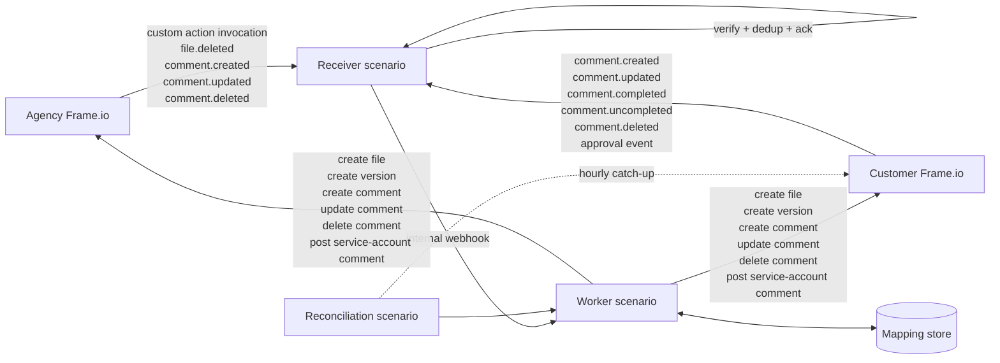
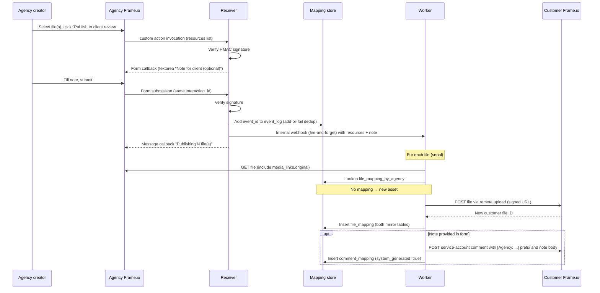
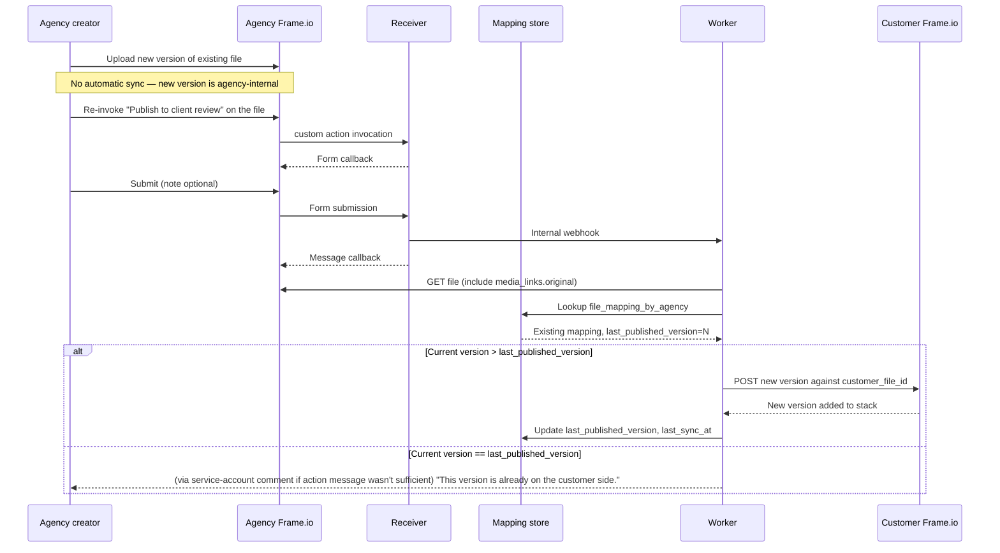
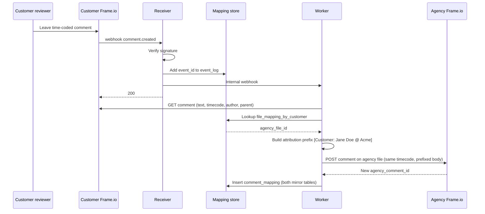
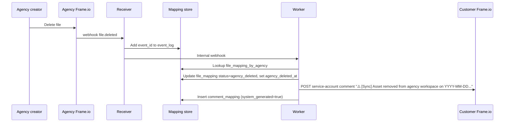
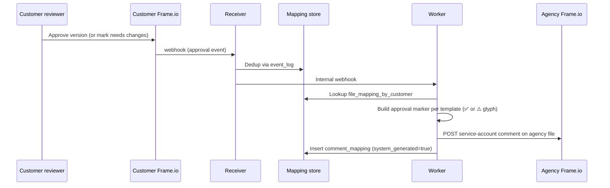

# Frame.io Two-Instance Sync — Detailed Design

| | |
|---|---|
| Status | Draft v0.2 |
| Owner | _to be assigned_ |
| Last updated | 13 May 2026 |
| Reviewers | Agency engineering, Customer IT, Solutions architecture |
| Revision history | v0.1 (12 May 2026) → v0.2 (13 May 2026, post-design-review) |

---

## 1. Executive summary

This document describes an integration that synchronises selected assets and feedback between two Adobe Frame.io V4 instances: one operated by a creative agency, the other by the customer they serve. The agency instance is the canonical source for assets and internal collaboration. The customer instance is a curated review surface for stakeholder feedback.

Asset publication is **explicit**: the agency creator invokes a "Publish to client review" custom action on one or more files, which propagates them (and any subsequent re-invoked versions) to the customer instance. Customer feedback (comments and approvals) flows back to the agency instance via the integration's service account, with attribution prefixed onto comment bodies. Agency-originated cross-boundary comments flow to the customer side too — either implicitly via replies to already-mirrored customer comments, or explicitly via a `>>client ` prefix convention on new top-level comments. Internal agency commentary that lacks either signal stays on the agency side and never reaches the customer.

A small orchestrator between the two instances listens to Frame.io V4 webhooks and custom-action events, calls the V4 REST API to mirror the right state changes, and maintains an ID mapping store so each agency object remains linked to its customer twin. The recommended implementation is Workfront Fusion. This document is honest about Fusion's constraints — several aspects of the design (idempotency, two-way lookups, the worker queue pattern) require HTTP modules and denormalised Data Store usage rather than connector primitives, but the receiver-worker scenario chain and Adobe-stack alignment justify the choice for Phase 1.

## 2. Background and motivation

Agencies and their clients have different operational needs from a review platform. The agency needs space for works-in-progress, raw assets, and candid internal critique. The client needs a clean review surface showing only what has been deemed ready, with full commenting and approval workflows, governed by their own IT and compliance regime. Running both groups in a single Frame.io workspace forces compromises on both sides — either internal mess leaks to the client, or the client has to be trained to ignore drafts.

Two separate Frame.io accounts (one agency-owned, one customer-owned) solve the trust-boundary problem cleanly but introduce a synchronisation gap: assets manually re-uploaded between accounts drift, and feedback collected in one cannot easily be acted on in the other. This integration closes that gap with a controlled, asymmetric sync where the deliberate boundary between the two accounts is preserved at all times — including by ensuring that no human user has a presence in both workspaces.

## 3. Scope

### In scope

- **Asset publication** from agency to customer via the "Publish to client review" custom action invoked on one or more files (Frame.io V4 multi-asset support up to 100 resources per invocation).
- **Version publication**: re-invocation of the publish action on a file with an existing mapping pushes the current agency-side version onto the customer-side version stack.
- **Filename copy** at publish time (the only metadata that crosses).
- **Customer-to-agency comment propagation**, including replies, edits, completion state, and deletion.
- **Agency-to-customer comment propagation** for comments that explicitly opt in to crossing the boundary — either by being a reply to an already-mirrored customer comment, or by carrying a `>>client ` prefix on a top-level body.
- **Customer-to-agency approval propagation** as a one-way signal: customer-side approval state changes are surfaced as service-account-authored comments on the agency-side file.
- **Mapping store** for file, comment, and project-pairing relationships.
- **Webhook signature verification**, retry handling, audit logging, hourly reconciliation backstop for comments and approvals.

### Out of scope

- Synchronisation of internal agency comments to the customer instance (only explicitly-opted-in comments cross).
- Synchronisation of new asset variations from the customer instance to the agency instance (assets never flow upstream).
- Synchronisation of folder hierarchy (no folder convention exists; the custom action is the only publication trigger).
- Ongoing metadata sync after initial publish (filename, description, tags, custom fields are not re-propagated when changed on either side).
- Retraction of published assets — agency-side deletion is recorded with a marker comment on the customer file, but the customer-side file is never removed or hidden.
- Agency-side comment completion propagating to the customer (completion is the customer's prerogative; signal flows customer-to-agency only).
- Real-time co-editing or presence indicators.
- Identity federation between the two Adobe accounts (each account manages its own users; agency users are not members of the customer workspace).
- Pre-existing legacy state at cutover. This integration assumes a greenfield agency–customer pairing.

### Non-goals

- Replacing the Frame.io UI on either side.
- Building a unified inbox or notification surface across both instances.

## 4. Architecture overview

### 4.1 System context

Three logical systems:

- **Agency Frame.io** — Adobe Frame.io V4 account owned by the agency. Contains all WIP, raw footage, internal collaboration, and the canonical version stack for every asset.
- **Customer Frame.io** — Adobe Frame.io V4 account owned by the customer. Contains only assets explicitly published via the custom action and the customer's feedback on them.
- **Sync orchestrator** — A pair of chained Fusion scenarios (receiver + worker) plus scheduled reconciliation and retry scenarios. Listens to webhooks and custom-action events from both instances, calls both V4 APIs, and maintains a Data Store mapping store.

### 4.2 Data flow



The orchestrator is stateless except for its mapping store. Webhooks are processed asynchronously: the receiver scenario verifies and dedups in well under the 10-second custom-action timeout, then chains to a worker scenario via an internal webhook. Worker work is genuinely async, can take as long as needed, and is retried independently.

### 4.3 Trust boundaries

Each Frame.io account is a separate trust boundary. **Agency users are not members of the customer workspace, and customer users are not members of the agency workspace.** All cross-boundary communication flows through the orchestrator's service account on each side. This means the design's trust separation is architectural, not behavioural — there is no surface on which a user could leak across the boundary by typing on the wrong side, because they have no access to the wrong side.

The orchestrator holds OAuth Server-to-Server credentials for both accounts, scoped to a dedicated service-account Adobe ID per side with the minimum role needed (typically Editor or a custom role permitting file create, comment create/update/delete, and webhook administration). Credentials are stored in a secrets manager (referenced from the pairing config) and rotated independently per side.

## 5. Frame.io V4 primitives used

| Primitive | Role in this design |
|---|---|
| Workspace | Webhook subscription scope. One review workspace per side. |
| Project | The unit of work. Agency and customer projects are paired 1:1 in the mapping store. |
| Folder | Organisational structure on the customer side. The pairing config names a target folder where published files land. |
| File | The asset itself. Carries `view_url`, `media_links.original`, version stack reference. |
| Version stack | Holds the iteration history of a file. The orchestrator appends new versions on re-invocation of the publish action. |
| Comment | Carries text, timecode, drawing region, author, completion state. Tied to a file ID. |
| Custom Action | The primary publish trigger. Beta in V4; see §6.3 maturity caveat. Supports multi-asset invocation up to 100 resources. |
| Approval state | Customer-side per-version state. The orchestrator subscribes to its change event and surfaces approvals as agency-side service-account comments. |
| Webhook | Push notification channel for non-action events. One subscription per side. |

The integration writes no custom fields to Frame.io objects. All cross-reference state lives in the mapping store.

## 6. Detailed design

### 6.1 Authentication

Both Frame.io accounts use **OAuth Server-to-Server credentials** via the Adobe Developer Console. For each account, an integration project is created in the console, the Frame.io API is added to it, and Server-to-Server credentials are generated (`client_id` + `client_secret`). The orchestrator exchanges these directly with the Adobe IMS token endpoint for an access token using the `client_credentials` grant, with no browser, no consent flow, and no refresh-token rotation to manage. Tokens are short-lived and re-issued on demand or on a refresh timer.

A dedicated service-account Adobe ID is provisioned per side. This identity owns the credential grant, is the visible author of any objects the orchestrator creates on each side, and has its access scoped to the agency or customer workspace respectively. The service account does not need account-admin rights — workspace-level Editor with webhook permissions and custom-action invocation rights is sufficient.

Secrets (the `client_secret` and the workspace webhook signing secrets, see §6.2) are stored in a managed secrets manager (region-co-located with the orchestrator per §12), and referenced from the pairing config via key. Secrets are never persisted to the mapping store and never logged.

This deployment is single-tenant — one agency, one customer, one credential pair per side. Multi-tenant deployments (one orchestrator serving many agency-customer pairings) are not in scope and would require revisiting credential scoping.

### 6.2 Webhook subscriptions

Two webhooks plus one custom action registration per side, all pointing at the orchestrator's receiver-scenario endpoint.

**Agency workspace**

- Custom action: `Publish to client review` — the primary publication trigger. Configured with multi-asset support enabled. See §6.3.
- Webhook subscription:
  - `file.deleted` — triggers the agency-deletion marker flow (§7.6)
  - `comment.created` — for detecting agency-originated cross-boundary comments (`>>client ` prefix or reply-to-mirrored, see §7.9)
  - `comment.updated` — for propagating edits to agency-originated cross-boundary comments
  - `comment.deleted` — for propagating deletions of agency-originated cross-boundary comments

**Customer workspace**

- Webhook subscription:
  - `comment.created`
  - `comment.updated`
  - `comment.completed`
  - `comment.uncompleted`
  - `comment.deleted`
  - Approval state change event _(verify exact V4 event name at implementation time)_

Note the deliberate asymmetry on completion events: agency-side completion is **not** subscribed. Completion sync is one-way (customer → agency only); the customer is the authority on whether their feedback is resolved.

Each subscription is created via `POST /v4/accounts/{account_id}/workspaces/{workspace_id}/webhooks`. The signing secret is returned only once in the creation response and must be captured immediately. The same applies to the custom action's signing secret, returned in its creation response.

### 6.3 Gating mechanism

A single trigger: **the `Publish to client review` custom action** on the agency workspace. Agency creators invoke it on one or more selected files. The action's payload (per the V4 multi-asset custom action contract) carries the list of resource IDs, the invoking user, the workspace and project context, and any data submitted via the form callback.

The action's lifecycle:

1. **Initial invocation.** Frame.io POSTs the action payload to the receiver scenario. The receiver returns a **form callback** (per V4 custom action spec) containing a single textarea field labelled "Note for client (optional)". No other input is collected.
2. **Form submission.** The user fills in the note (or leaves it blank) and submits. Frame.io POSTs the form data back to the same URL with the same `interaction_id`.
3. **Receiver work.** The receiver verifies the signature, attempts to insert the Frame.io event ID into `event_log` (dedup via Data Store add-or-fail — see §8.2), enqueues a worker job per file in the `resources` list (fire-and-forget POST to the internal worker webhook), and returns a **message callback** to the user: `Publishing N file(s) to client review. They'll appear shortly.`
4. **Worker work.** The worker processes each enqueued file serially. See §7.1 for the new-asset case and §7.2 for the new-version case.

Polymorphic handler: the worker looks up `file_mapping_by_agency` for each agency file ID. No mapping → new-asset flow. Mapping exists with `last_published_version` equal to current → no-op with a sync-status update only. Mapping exists with `last_published_version` less than current → version-push flow.

**Maturity caveat.** V4 Custom Actions are currently in beta. The integration's primary publish trigger depends on a beta API surface. Implementation should track Frame.io's beta-to-GA transitions and validate the action's payload shape, form callback structure, and message callback against the live reference at the time of build.

### 6.4 Mapping store schema

The mapping store is implemented on Fusion Data Stores. Data Stores support fast lookup only by primary key; secondary-field lookups are full scans. For tables that need two-way lookup (file and comment mappings), this is handled by **denormalised mirror tables** — the same logical row is written to two physical Data Stores, one keyed by each side's identifier. Worker scenarios write both on every change; on partial failure, the next retry re-creates both.

**`file_mapping_by_agency`**

| Field | Type | Notes |
|---|---|---|
| `agency_file_id` | UUID | Primary key |
| `customer_file_id` | UUID | |
| `agency_workspace_id` | UUID | |
| `customer_workspace_id` | UUID | |
| `agency_project_id` | UUID | |
| `customer_project_id` | UUID | |
| `last_published_version` | integer | Last successfully synced version (agency side may be ahead) |
| `created_at` | timestamp | First publication |
| `last_sync_at` | timestamp | Most recent successful sync |
| `agency_deleted_at` | timestamp, nullable | Set when agency-side `file.deleted` is processed |
| `status` | enum | `active`, `failed`, `agency_deleted` |

**`file_mapping_by_customer`** — mirror of the above, primary key on `customer_file_id`, all other fields duplicated.

**`comment_mapping_by_source`**

| Field | Type | Notes |
|---|---|---|
| `source_comment_id` | UUID | Primary key — comment ID on the side where the comment was originally authored |
| `target_comment_id` | UUID | Comment ID on the opposite side, created by the orchestrator |
| `sync_direction` | enum | `customer_to_agency`, `agency_to_customer` |
| `file_mapping_agency_id` | UUID | For reverse lookup to the file |
| `parent_source_comment_id` | UUID, nullable | For reply threading on the source side |
| `original_author_name` | string | For attribution prefix |
| `original_author_email` | string | For deeper attribution lookups and GDPR subject-rights handling (§12) |
| `system_generated` | boolean | `true` for service-account-authored entries (approval markers, deletion markers, failure messages) |
| `created_at` | timestamp | |

**`comment_mapping_by_target`** — mirror of the above, primary key on `target_comment_id`, all other fields duplicated.

**`event_log`**

| Field | Type | Notes |
|---|---|---|
| `event_id` | string | Primary key. Frame.io-supplied event ID from the webhook payload or delivery header. Dedup uniqueness is enforced via Data Store primary-key collision (add-or-fail). |
| `received_at` | timestamp | Wall-clock receive time for latency metrics; not part of dedup logic. |
| `source_account_id` | UUID | Agency or customer. |
| `event_type` | string | e.g. `comment.created`, `custom_action.publish`, `file.deleted`. |
| `interaction_id` | UUID, nullable | For custom action sequences (links the action invocation, form submission, and resulting message). |
| `resource_id` | UUID | The primary file or comment ID from the payload. |
| `processed_at` | timestamp, nullable | Null until processed. |
| `outcome` | enum | `success`, `skipped`, `failed`, `retrying`, `skipped_agency_deleted`. |
| `error_detail` | text, nullable | |
| `attempt_count` | integer | |

Retention of `event_log` is configured via `project_mapping.event_log_retention_days` (default 90) — see §12.

**`project_mapping`**

| Field | Type | Notes |
|---|---|---|
| `pairing_id` | string | Primary key (`"default"` for single-pairing deployment) |
| `agency_account_id` | UUID | |
| `agency_workspace_id` | UUID | |
| `agency_project_id` | UUID | |
| `customer_account_id` | UUID | |
| `customer_workspace_id` | UUID | |
| `customer_project_id` | UUID | |
| `customer_target_folder_id` | UUID | Where published files land on the customer side |
| `agency_publish_action_id` | UUID | Custom action ID, used for defence-in-depth validation |
| `agency_service_account_user_id` | UUID | For filtering self-authored comments out of sync (prevents echoes) |
| `customer_service_account_user_id` | UUID | Same on customer side |
| `agency_signing_secret_ref` | string | Reference into secrets manager |
| `customer_signing_secret_ref` | string | Reference into secrets manager |
| `agency_oauth_credentials_ref` | string | Reference into secrets manager |
| `customer_oauth_credentials_ref` | string | Reference into secrets manager |
| `customer_to_agency_prefix` | string | Template, default `[Customer: {author_name} @ {workspace_name}]` |
| `agency_to_customer_prefix` | string | Template, default `[Agency: {author_name} @ {workspace_name}]` |
| `approval_marker_template` | string | Template, default `{glyph} [Customer: {author_name} @ {workspace_name}] {action} this version on {date}` |
| `deletion_marker_template` | string | Template, default `⚠️ [Sync] This asset was removed from the agency workspace on {date}. The version above remains available for your reference.` |
| `reconciliation_cadence_minutes` | integer | Default 60 |
| `event_log_retention_days` | integer | Default 90 |
| `status` | enum | `active`, `paused`, `disabled` |
| `created_at`, `updated_at` | timestamp | |

Secrets themselves are never stored in this table — only references that the secrets manager resolves. The receiver and worker scenarios cache the pairing config row at scenario-start to avoid repeated Data Store reads within a single execution.

**`pending_events`** and **`failed_events`** — work-queue tables. The receiver inserts to `pending_events` after dedup; the worker scenario triggered via the internal webhook consumes them. Permanent failures (after retry exhaustion) are moved to `failed_events` for operator inspection. Trivial structure: `event_id` as primary key, plus the original event payload as a JSON blob, plus retry counter and timestamps.

## 7. Key flow sequences

### 7.1 New asset publication (agency → customer)



### 7.2 New version on existing file



The deliberate design choice: new versions on the agency side do not auto-sync. Each version that should reach the customer requires a re-invocation of the action, preserving the agency's ability to iterate privately between published versions.

### 7.3 Customer comment creation



### 7.4 Customer comment update, completion, or deletion

For each follow-up event (`comment.updated`, `comment.completed`, `comment.uncompleted`, `comment.deleted`), the worker looks up the comment in `comment_mapping_by_source` by `customer_comment_id`, finds the paired `target_comment_id` on the agency side, and issues the equivalent PATCH or DELETE. On `comment.deleted`, the mapping row is soft-deleted (status flag preserved on `comment_mapping` for audit) rather than hard-deleted, so the `event_log` remains coherent.

Completion direction is asymmetric and deliberate. Customer-side completion propagates to the agency side, surfacing the customer's "I consider this addressed" signal in the agency's view. Agency-side completion does **not** propagate to the customer — the agency may mark complete locally for their own bookkeeping, but the customer remains the authority on whether their feedback is resolved.

### 7.5 Reply handling and the agency-side reply auto-mirror

When a customer comment arrives with a non-null `parent_id`, the orchestrator looks up the parent in `comment_mapping_by_source`, retrieves the agency-side parent comment ID, and creates the reply against that. If no mapping exists for the parent (race condition — parent webhook hasn't been processed yet), the reply event is requeued with a short delay and retried.

When an agency creator replies on the agency side to a comment that is itself a mirrored customer comment (i.e., the parent comment is in `comment_mapping_by_target`), the reply is treated as a customer-facing response and propagated back to the customer side as a reply on the original customer thread. Attribution prefix is applied per the agency-to-customer template. This is the implicit opt-in for the most common case of cross-boundary dialogue and requires no action from the agency creator beyond replying naturally.

### 7.6 File deletion on the agency side



The customer-side file persists permanently. Once an asset has been shared with the customer, it is part of their record, and the agency cannot unilaterally retract it. "Deleted by the agency" is a status, surfaced via the marker comment, not a removal.

Comments arriving on customer-side files in `status = agency_deleted` are logged in `event_log` with outcome `skipped_agency_deleted` and not propagated — there is no agency-side file to sync to. This is the one-way trailing state of the asset's lifecycle.

Accidental delete recovery: if the agency creator deletes the wrong file, re-uploading and re-publishing creates a fresh mapping and a separate customer-side file. The original customer-side file (with its review history and the "removed" marker comment) becomes an orphan. A future "re-link agency file to existing customer file" admin operation is out of scope for Phase 1.

### 7.7 Initial cutover

This deployment is greenfield. Both sides start empty for the agency–customer relationship. Provision the `project_mapping` row per §10, run the cutover smoke test per §10.3, and proceed. There is no backfill operation in scope, because there is no pre-existing state to backfill. Deployments with pre-existing legacy state would require a manual "link to existing customer file" admin action that is not part of Phase 1.

### 7.8 Customer approval signal (customer → agency)



Approval state itself is not propagated to the agency's own version stack — only the **signal** is, as a service-account comment. This keeps the agency's internal approval workflow (if any) decoupled from the customer's verdict, and surfaces the customer's decision in a place the agency creator will see during normal review.

### 7.9 Agency-originated cross-boundary comment (agency → customer)

```mermaid
sequenceDiagram
    participant U as Agency creator
    participant AF as Agency Frame.io
    participant Rcv as Receiver
    participant DB as Mapping store
    participant W as Worker
    participant CF as Customer Frame.io

    U->>AF: Post comment (top-level with ">>client " prefix, OR reply to mirrored customer comment)
    AF->>Rcv: webhook comment.created
    Rcv->>DB: Dedup
    Rcv->>W: Internal webhook
    W->>AF: GET comment (text, parent, author)
    alt Body starts with ">>client "
        W->>W: Strip prefix; flag as opt-in top-level
    else Parent in comment_mapping_by_target
        W->>W: Flag as reply to mirrored customer comment
    else
        W->>DB: Log as skipped (internal agency comment)
        Note over W: Stop processing
    end
    W->>DB: Lookup file_mapping_by_agency
    W->>W: If reply, resolve customer-side parent comment ID via comment_mapping
    W->>CF: POST service-account comment on customer file with [Agency: ...] prefix
    W->>DB: Insert comment_mapping (sync_direction=agency_to_customer)
```

Defaults stay safe: a comment with neither marker is internal and never crosses. The cost of a forgotten `>>client ` prefix is a customer not seeing useful feedback (recoverable — re-post). The cost of a misfired opt-in would be private commentary leaking to the customer (the prefix is sufficiently unusual that accidental triggering is unlikely).

## 8. Operational considerations

### 8.1 Webhook and custom-action signature verification

Every incoming webhook or custom-action invocation is verified before processing:

1. Read `X-Frameio-Request-Timestamp` and `X-Frameio-Signature` headers.
2. Reject if the timestamp is more than 5 minutes from server time (replay protection).
3. Compute HMAC SHA-256 over `v0:{timestamp}:{raw_body}` using the relevant signing secret (workspace webhook secret or custom action secret, depending on source).
4. Compare to the provided signature (prefixed `v0=`); reject on mismatch.

Verification happens before parsing the body to avoid processing unverified content. Frame.io's custom-action timeout is **10 seconds** with up to 5 retries on non-2xx responses; webhook timeout is similar. The receiver scenario must return 2xx well under the 10-second window — for the design as specified, signature verification + dedup add + internal webhook fire-and-forget complete in under a second comfortably.

### 8.2 Idempotency

Webhooks and action invocations are retried by Frame.io on non-2xx responses or timeouts. The orchestrator achieves idempotency via the Frame.io event ID:

- The receiver attempts to `Add` the Frame.io event ID (from the payload or delivery header, name to be confirmed against current V4 reference) to `event_log` as the primary key.
- On primary-key collision, the event has already been received — return 2xx immediately without further processing.
- On successful add, proceed to enqueue and ack.

This pattern uses the Data Store's primary-key uniqueness as the dedup primitive, which is the only race-safe pattern available in Fusion (read-then-write races between concurrent retries). It must not be replaced with a "search then add" sequence.

Worker idempotency is additionally enforced at the operation level:

- Before creating a customer-side file, the worker checks `file_mapping_by_agency`. If a mapping exists, the worker enters the version-push branch rather than re-creating.
- Before creating a comment on either side, the worker checks `comment_mapping_by_source`. If a mapping exists, the operation is a no-op.

### 8.3 Rate limits and multi-asset bursts

Frame.io V4 rate-limits at 100 calls per minute per account-user on most endpoints. The orchestrator's service account is one user per side, so all sync activity contends for the same budget per side.

For normal interactive load (sparse comments, one-at-a-time publishes) this is ample. The relevant pressure case is **multi-asset publish bursts**: a creator selects 80 files and invokes the publish action once. With ~4 API calls per file end-to-end, naive parallel fan-out would attempt ~320 calls in seconds and immediately exceed the per-minute ceiling.

**Phase 1 mitigation: serial worker.** The receiver enqueues one worker job per file in the `resources` list. The worker scenario processes files sequentially, one at a time. For an 80-file batch this takes roughly 6–8 minutes end-to-end (the first files appear on the customer side within seconds; the last after several minutes). The creator's message-callback feedback ("Publishing N file(s)") is optimistic at the moment of submission; per-file outcomes surface individually as files materialise or as failure comments appear.

Per-file error isolation: a single file failing inside a batch does not stop the rest. The worker catches per-file errors, records them in `event_log` with outcome `failed`, fires the service-account-failure-comment on that specific file, and continues to the next.

If observed batch latency proves unacceptable in production, Phase 3 may upgrade to bounded parallel workers with a shared rate-limit token bucket Data Store row. This is a known enhancement, deliberately not built in Phase 1.

### 8.4 Signed URL handling

`media_links.original.download_url` on V4 is a temporary signed S3 URL with a TTL of approximately 24 hours (verify against current V4 reference). For the agency's workload of finished video and image deliverables, this TTL is comfortably more than the time Frame.io's `remote_upload` endpoint needs to fetch and ingest on the customer side.

The orchestrator must not cache the signed URL. The worker fetches it immediately before initiating the customer-side `remote_upload` call and hands it off inline. Frame.io's backend then performs the fetch directly from the agency's signed URL; the orchestrator does not proxy bytes.

No Frame.io V4 cross-account asset copy primitive exists (verified against current Frame.io docs — copy and move are explicitly restricted to within-account operations). If the workload ever expands to include very large files (raw camera footage of 50 GB+) where the signed URL TTL becomes marginal, a dedicated streaming proxy component would be required (Fargate/ECS, not Fusion or Lambda — neither is suited to multi-GB binary streaming). This is out of scope for the current workload.

### 8.5 Comment attribution

All cross-boundary comments are authored by the integration service account on the receiving side, never by the original human author (since the original author is not a member of the receiving workspace by design). To preserve attribution, comment bodies are prefixed per the templates in `project_mapping`:

- Customer → agency: `[Customer: Jane Doe @ Acme] Move the logo 4px left.`
- Agency → customer: `[Agency: Chris @ <Agency>] Focus on the second-act pacing in this cut, please.`
- Customer approval markers: `✅ [Customer: Jane Doe @ Acme] approved this version on 2026-05-13.`
- Deletion markers: `⚠️ [Sync] This asset was removed from the agency workspace on 2026-05-13. The version above remains available for your reference.`

The agency-side opt-in for top-level cross-boundary comments uses a `>>client ` prefix on the comment body. The orchestrator strips the prefix before adding the attribution prefix and posting on the customer side. Replies to mirrored customer comments are auto-mirrored without needing the opt-in prefix.

For richer attribution, prefixes can include a deep-link to the source-side comment using its `view_url` — letting the agency creator jump straight to the customer's view if needed.

### 8.6 Monitoring and alerting

The orchestrator emits metrics for:

- Webhook receipts per source per event type (counter)
- Custom action invocations and form submissions per source (counter)
- Processing latency p50/p95/p99 (histogram)
- Failure rate per operation type (counter, alerting threshold ≥5% over 5 minutes)
- Rate-limit hits per side (counter, alerting threshold ≥10 per minute)
- Mapping store size by table (gauge)
- Reconciliation metrics: `comments_checked`, `comments_resynced`, `approvals_resynced`, `event_log_rows_retried`, `run_duration_seconds` (per reconciliation run)
- Alert if `reconciliation_comments_resynced > 5` sustained across runs — indicates the webhook path is failing for some reason

Alerts route to the integration owner team. The event log is queryable for support investigations ("did the customer's 2:34pm comment reach the agency?").

### 8.7 Error scenarios

| Scenario | Handling |
|---|---|
| Signature verification fails | Reject with 401, log, alert if rate exceeds threshold |
| Mapping lookup miss on an update event | Requeue with delay; if still missing after 3 attempts, log as orphan and alert |
| 401 from Frame.io API | Refresh OAuth token; if refresh fails, alert immediately (credential rotation needed) |
| 404 from Frame.io API on previously-mapped resource | Mark mapping row as `failed`, surface in admin view |
| 429 from Frame.io API | Exponential backoff with jitter, max 5 retries |
| 5xx from Frame.io API | Retry with backoff, max 5 retries, then mark event as `failed` |
| Agency deletes a published file | Mark `file_mapping` status `agency_deleted`, post marker comment on customer file, leave customer file intact |
| Customer comment arrives on `agency_deleted` file | Log with outcome `skipped_agency_deleted`, do not propagate |
| Worker scenario fails terminally | Post service-account failure comment on the relevant agency file with summarised reason, move row to `failed_events` for operator inspection |
| Frame.io custom action retry exhaustion | User sees Frame.io's native "action failed" UI; integration has no recovery path; user re-invokes |

### 8.8 Asynchronous processing pattern

The integration uses **two-scenario chaining** for ack-and-enqueue, not polling:

- **Receiver scenario**: triggered directly by the Frame.io webhook or custom action. Steps: verify signature → load pairing config from `project_mapping` (cached for the scenario) → defence-in-depth check that action ID and workspace IDs match expected → attempt `Add` to `event_log` for dedup → fire-and-forget HTTP POST to the internal worker webhook URL with the event payload → return 2xx (or the appropriate custom-action callback). Total wall-clock time well under one second; comfortably under the 10-second action timeout.
- **Worker scenario**: triggered by the internal webhook. Loads pairing config; performs the actual API work; updates mapping store; on terminal failure, posts the failure comment via service account and moves the row to `failed_events`. Runs at full asynchronous pace, not constrained by any webhook timeout.

Polling is deliberately **not** used as the queue mechanism — the chained-scenario pattern eliminates the latency floor a scheduled polling worker would impose. The reconciliation scenario (§8.9) is the only scheduled component, and runs sparsely.

### 8.9 Reconciliation scenario

A scheduled scenario runs hourly (configurable via `project_mapping.reconciliation_cadence_minutes`) as a safety net for missed comment and approval events. This is **not** a general-purpose drift detector — see the asymmetric resilience note below.

Scope of what it queries:

- Customer-side comments modified or created since `last_reconciliation_at - 1 hour` (1-hour overlap for clock skew safety). For each, check `comment_mapping_by_source`; for unmapped comments on actively-mapped files, enqueue via the standard worker webhook with a synthetic event ID derived from the comment ID and the reconciliation hour.
- Customer-side approval state changes within the same window. Same lookup-and-enqueue pattern.
- `event_log` rows in `outcome = retrying` for longer than 30 minutes, or in `outcome = failed` and younger than 24 hours: re-enqueue.

Scope of what it does **not** query:

- Agency-side files: there is no notion of "eligible files awaiting sync." The custom action is the only legitimate trigger, and lost action invocations are not detectable after the fact.
- Agency-side comments: agency-originated cross-boundary comments are detected at creation by the agency webhook. Missed-comment recovery on the agency side has the same limitation as missed-publish — no persistent intent record.

Idempotency for reconciliation: the synthetic event ID prevents within-cadence duplication (re-running the same reconciliation hour produces the same synthetic ID and the dedup catches it). Belt-and-braces: the worker checks `comment_mapping_by_source` before acting, so any race between original-event arrival and reconciliation re-attempt resolves cleanly.

**Asymmetric resilience trade-off — important.** Reconciliation can recover from missed customer-side events (comments, approvals) because customer-side state is queryable. It cannot recover from missed publish-action invocations, because Frame.io does not persist a record of "the user clicked the custom action but the integration didn't catch it" beyond its 5-retry window. The mitigation is that publish failures are **user-visible at click time** (Frame.io surfaces "action failed" to the agency creator after retry exhaustion), so the recovery path is "re-click" rather than silent loss. This is an accepted trade-off of the custom-action gating choice.

## 9. Build options

### 9.1 Workfront Fusion (recommended for Phase 1)

Fusion provides a Frame.io connector with native triggers and actions, a Data Store module for the mapping schema, automatic retry handling, and a visual scenario builder. The integration uses four scenarios:

- **Receiver** (HTTP webhook-triggered): handles both webhook events and custom-action invocations. Signature verification, dedup, ack, internal-webhook chain to worker.
- **Worker** (internal-webhook-triggered): performs the actual API work for one event. Handles new-asset, version-push, comment-creation, comment-update, comment-delete, approval marker, deletion marker.
- **Reconciliation** (scheduled, hourly): the safety-net catch-up.
- **Retry** (scheduled, e.g. every 5 minutes): drains `failed_events` and `pending_events` for stuck rows.

Honest acknowledgment of constraints: several aspects of the design rely on HTTP modules and denormalised Data Store patterns rather than connector primitives. Specifically — the custom action invocation is received via HTTP module (not the connector's native triggers); OAuth Server-to-Server may require HTTP module with custom auth handling; two-way mapping lookups require mirror tables because Data Stores index only the primary key; dedup uses Data Store add-or-fail rather than a proper uniqueness constraint; the queue is implemented via internal webhook chaining rather than a native queue primitive. None of these are blockers; all add build effort beyond what a "scenario builder" suggests.

**Pros:** No infrastructure to operate. Native fit with the Adobe stack. Visual scenario builder useful for ops. Receiver-worker chain is a natural Fusion pattern.

**Cons:** Scenario-level cost scales with operation count. HTTP-module workarounds required for several flows. Debugging complex branching is sometimes awkward. Data Store's lack of secondary indexes and conditional writes shapes the schema.

### 9.2 Custom serverless (alternative)

A pair of webhook endpoints (one per side) backed by a queue and worker pattern. Recommended stack on AWS: API Gateway + Lambda (webhook receivers) + SQS (event queue with FIFO and native dedup) + Lambda (workers) + DynamoDB (mapping store, with proper GSIs for two-way lookups and conditional writes for dedup) + Secrets Manager (OAuth credentials) + CloudWatch (logs and metrics). Equivalents on GCP and Azure are straightforward.

This is a viable alternative if Fusion's constraints prove painful in practice or if the customer organisation prefers AWS-native deployment. Build time is comparable to Fusion once Fusion's HTTP-module workarounds are accounted for honestly. The serverless path also offers cleaner solutions for the dedup, two-way lookup, and queue patterns.

### 9.3 Decision criteria

| Criterion | Fusion | Serverless |
|---|---|---|
| Time to first pilot | ★★ | ★ |
| Engineering effort | ★★ | ★ |
| Operational complexity | ★★★ | ★★ |
| V4 feature coverage | ★★ | ★★★ |
| Cost at high volume | ★★ | ★★★ |
| Adobe stack alignment | ★★★ | ★★ |
| Debug and observability | ★★ | ★★★ |
| Dedup / two-way lookup fit | ★ | ★★★ |

**Recommendation:** Phase 1 on Fusion as confirmed. Revisit at Phase 2 hardening if operational pain points emerge.

## 10. Setup and configuration

### 10.1 One-time setup per Frame.io account

For each side (agency, customer):

1. Create an integration project in the Adobe Developer Console.
2. Add the Frame.io API to the project.
3. Generate OAuth Server-to-Server credentials (`client_id` + `client_secret`).
4. Provision a dedicated Adobe ID for the integration service account.
5. Invite the service account to the relevant workspace with the minimum required role (Editor or custom role per §6.1).
6. Store credentials in the orchestrator's secrets manager; record the reference key.
7. Create the workspace webhook subscriptions per §6.2 via API; capture and store each signing secret.
8. **On the agency side only:** create the `Publish to client review` custom action via API with multi-asset support enabled; capture its ID and signing secret.

### 10.2 Per-pairing configuration

For the single agency–customer pairing in scope:

1. Identify the agency project and the corresponding customer project.
2. Identify or create the target folder on the customer side where published assets will land.
3. Insert the `project_mapping` row with all fields per §6.4. Reference secrets by key; never embed secret values in the row.
4. Verify the row by running a smoke test (§10.3).

### 10.3 Cutover checklist

- [ ] OAuth Server-to-Server credentials present and validated on both sides
- [ ] Both webhook subscriptions created and signing secrets stored
- [ ] Agency-side custom action registered with multi-asset support and signing secret stored
- [ ] Both service accounts confirmed in their respective workspaces with the minimum required role
- [ ] Mapping store (all tables, including mirror tables) provisioned and empty
- [ ] Pairing config row inserted with correct identifiers, secret references, and templates
- [ ] Region of deployment confirmed and documented per §12
- [ ] Smoke test: publish one asset via the action, verify it appears on customer side; leave one customer comment, verify it appears on agency side; mark approval on customer side, verify the agency-side service-account comment appears
- [ ] Monitoring dashboards live; alert thresholds configured
- [ ] Runbook published to support team

## 11. User experience

### 11.1 Agency creator

Works entirely in the agency Frame.io. Drops WIP, raw cuts, and works-in-progress anywhere in the agency project — none of this reaches the customer.

When ready to share an asset with the customer, selects one or more files (up to 100 in a single action invocation) and clicks "Publish to client review" from the action menu. Frame.io displays a small form with an optional "Note for client" textarea. The creator may add context — for example, "Focus on the second-act pacing in this cut" — or leave the note blank. After submitting, Frame.io confirms with a message: "Publishing N file(s) to client review." The first files typically appear on the customer side within seconds; large batches take a few minutes for the last files.

To revise an asset, the creator uploads a new version against the same agency-side file in the normal way. New versions are agency-internal by default — they do not auto-sync. When the creator decides the new version is ready for the customer, they re-invoke the "Publish to client review" action on the file. The orchestrator pushes the current version onto the existing customer-side version stack. Repeated invocations of the action on a file whose current version is already published produce a "this version is already on the customer side" message, no-op behind the scenes.

To read customer feedback, the creator opens the file in agency Frame.io. Customer comments appear inline with `[Customer: Jane Doe @ Acme]` attribution prefixes. Customer approvals appear as service-account comments prefixed `✅` or `⚠️`. Internal team replies stay unprefixed and do not sync.

To reply to a customer comment in a way the customer will see, the creator replies on the agency side to the mirrored comment — the orchestrator auto-mirrors the reply back to the customer's thread. To start a new top-level comment that should reach the customer, the creator prefixes the body with `>>client ` (lowercase, trailing space). To leave an internal comment that should not reach the customer, the creator simply writes the comment with no prefix.

If a published asset is deleted on the agency side, the customer-side copy persists permanently, but a service-account comment appears on the customer file indicating the agency has removed the asset and that future feedback on it will not reach the agency.

### 11.2 Agency PM or reviewer

Same Frame.io UI, no extra steps. Customer approvals surface inline on agency-side files as `✅ [Customer: ...] approved this version on 2026-05-13` comments — the cleanest single signal that a version has been signed off by the client. "Needs changes" verdicts appear with `⚠️` glyph and similar attribution. The agency's own internal approval workflow on the agency side is unaffected by these markers; they coexist as informational signals.

Status and approval state can additionally be surfaced into Workfront if the agency uses it for campaign tracking; this is out of scope for Phase 1 but listed as a future consideration.

### 11.3 Customer reviewer

Sees only the customer Frame.io. Receives standard Frame.io notifications when a new asset or version lands. Leaves time-coded comments, drawings, reactions, and approvals as in any review.

All cross-boundary commentary from the agency arrives as comments authored by the integration service account, prefixed `[Agency: ...]`. There are no agency human users in the customer workspace; agency-side staff cannot post directly. Replies to the customer's own comments and standalone agency-originated messages both surface through this single attribution channel.

If the agency removes an asset from its side, the customer's copy remains available for reference. A service-account comment appears on the asset explaining the change and noting that new feedback on that asset will not reach the agency. The asset and prior feedback remain visible for the customer's records.

### 11.4 Customer admin

Manages their workspace independently: user roster, integrations, retention, exports. Has no visibility into the agency workspace. The orchestrator cannot read data the customer admin has not granted access to via the service account's invitation and role.

## 12. Security and compliance

- All credentials in a managed secrets store, region-co-located with the orchestrator. Never logged. Never persisted to the mapping store.
- All webhook and custom-action signatures verified before processing.
- TLS 1.2 minimum between orchestrator and Frame.io.
- Mapping store encrypted at rest.
- No payload bodies (file contents, raw comment text) are persisted beyond the duration of a single operation. The mapping store records IDs, attribution metadata, and status, not content.

### 12.1 Regional deployment

The integration is deployed in a single region selected at provisioning time. All components — Fusion scenarios, Data Stores, secrets manager, logging surface — operate in that region. Data does not leave the region except for outbound API calls to Frame.io's published endpoints, which are governed by the customer's existing Frame.io DPA with Adobe.

For EMEA customers with GDPR exposure, the region should be an EU Fusion deployment. The region is a deployment parameter, not a per-pairing configuration; multi-region deployment is out of scope.

### 12.2 GDPR subject rights

The orchestrator processes user-generated text (comment bodies) and stores `original_author_name` and `original_author_email` in the mapping store for attribution. Customer-side reviewers are GDPR data subjects with respect to this data, with the agency as data controller for the mapping store.

A documented subject-rights procedure exists for each right:

- **Right of access**: an admin operation queries `comment_mapping` (both mirror tables) by email address and returns the matching rows.
- **Right to erasure**: rather than deleting rows (which would break comment-mapping integrity), the admin operation **anonymises** the `original_author_name` and `original_author_email` fields to `[redacted]`. Concurrently, the mirrored comment bodies on the agency side are PATCHed to replace any name/email content in the attribution prefix with `[redacted]`. The comments themselves are not removed.
- **Right to rectification**: the admin operation updates the fields and re-PATCHes the mirrored comment bodies similarly.

These operations must complete within the 30-day GDPR response window. Implementation is a small set of operator-invoked tools rather than user-facing UI in Phase 1.

The customer admin handles erasure on their own Frame.io side independently via Adobe's user-deletion flow. The agency-side service-account-authored comments mirroring that user's feedback are anonymised via the procedure above, leaving the comment text intact for audit while removing PII from the prefix.

### 12.3 Retention

- `event_log` is retained for `project_mapping.event_log_retention_days` (default 90, configurable per pairing). Longer retention available for customers with specific audit requirements; the cost of detailed event data accumulates linearly with the period.
- `file_mapping` and `comment_mapping` rows are retained for the lifetime of the underlying Frame.io objects on either side. They are not subject to the event-log retention policy.
- `failed_events` rows are retained for at least 90 days for incident investigation; expired rows are archived.

Both `original_author_name` and `original_author_email` retention is governed by the customer's DPA with the agency. The DPA should explicitly cover the agency's role as data controller for the mapping store contents.

## 13. Open questions

The following questions were raised in v0.1 and have been resolved in v0.2:

- ~~Comment completion direction~~: resolved — one-way customer → agency only (§7.4).
- ~~Multiple customer projects per agency project~~: resolved — out of scope; single pairing only.
- ~~Event log retention beyond 90 days~~: resolved — configurable per pairing via `project_mapping.event_log_retention_days`, default 90.
- ~~Asset deletion semantics~~: resolved — customer file persists permanently; agency deletion marked via service-account comment (§7.6).
- ~~Per-user attribution sufficiency~~: resolved — service-account-with-prefix approach is sufficient; per-customer-user service-account provisioning is out of scope.

The following items remain open and require validation at implementation time, not at design time:

1. Exact V4 event name for customer-side approval state changes — confirm against the live API reference and update §6.2.
2. Frame.io Custom Actions are currently in Beta. Validate the action payload shape, form callback structure, multi-asset support, and signature header names against the current Beta state at the time of implementation. Track the Beta-to-GA transition.
3. Confirm that V4 webhook delivery includes a stable event ID (in payload or header) usable as the dedup primary key. If not, an alternative dedup strategy will be needed; this would be a meaningful design change.
4. Confirm exact endpoint paths and request shapes for `remote_upload`, comment CRUD, and webhook administration against the current V4 reference (some routes remained under active development at the time of writing).

## 14. Implementation roadmap

### Phase 1 — Pilot (estimated 3–5 weeks)

- Fusion-based implementation of the full design as specified in this document.
- Single pairing, greenfield deployment.
- Custom action with form and message callbacks, multi-asset support, serial worker processing.
- Bidirectional comment sync with prefix-based opt-in and reply auto-mirror.
- Customer-to-agency approval sync via service-account comments.
- Agency-side deletion marker; no retraction.
- Mapping store with mirror tables; dedup via Data Store add-or-fail.
- Webhook chaining (receiver + worker scenarios); hourly reconciliation scenario; retry scenario for `failed_events`.
- Single deployment region per §12.
- Smoke-tested with non-production assets, then with one live customer engagement.

### Phase 2 — Hardening (estimated 2–3 weeks)

- Production-grade observability: complete metric coverage, dashboards, alert tuning.
- Operator tooling: paused-state toggle on `project_mapping`, manual retry of `failed_events`, GDPR subject-rights admin operations (access, anonymisation).
- Error-comment templates refined based on real failure patterns.
- Documentation and runbook completion.
- Beta-to-GA transition for V4 Custom Actions if it occurs in this window.

### Future considerations (not committed)

- Workfront project linkage for status surfacing.
- Bounded-parallel worker pattern with shared rate-limit Data Store row, if multi-asset burst latency proves unacceptable.
- Streaming proxy component for very large files, if the workload changes to include raw camera footage.
- Manual link operation for non-greenfield cutover, if a second agency-customer pairing is ever added.
- Customer-facing dashboard summarising review activity.
- Re-link operation for accidental-delete recovery.

## 15. Appendix — V4 endpoints and contracts used

| Operation | Endpoint or contract |
|---|---|
| Generate access token (OAuth Server-to-Server) | Adobe IMS token endpoint via `client_credentials` grant |
| Create webhook subscription | `POST /v4/accounts/{account_id}/workspaces/{workspace_id}/webhooks` |
| Create custom action | `POST` to V4 custom action registration endpoint (Beta — verify path and shape) |
| Custom action invocation payload (multi-asset) | Frame.io POSTs to configured URL with `resources` list, `interaction_id`, `data`, `user`, `workspace`, `project` |
| Custom action form callback response | JSON `{title, description, fields: [...]}` returned in HTTP response body |
| Custom action message callback response | JSON `{title, description}` returned in HTTP response body |
| Get file (with media links) | `GET /v4/accounts/{account_id}/files/{file_id}?include=media_links.original` |
| Create file (remote upload) | `POST /v4/accounts/{account_id}/folders/{folder_id}/files/remote_upload` |
| Create new version | `POST /v4/accounts/{account_id}/files/{file_id}/versions` |
| Create comment | `POST /v4/accounts/{account_id}/files/{file_id}/comments` |
| Update comment | `PATCH /v4/accounts/{account_id}/comments/{comment_id}` |
| Delete comment | `DELETE /v4/accounts/{account_id}/comments/{comment_id}` |
| Complete / uncomplete comment | `PATCH /v4/accounts/{account_id}/comments/{comment_id}` _(via `completed` field)_ |
| Approval state change event | Customer-side webhook subscription _(exact event name verify against current reference)_ |
| Signature verification | HMAC SHA-256 over `v0:{timestamp}:{body}`, signature prefixed `v0=`, replay window 5 minutes |

Exact endpoint paths and request shapes should be confirmed against the live V4 API reference at the time of implementation, as some routes remain under active development and Custom Actions are still in beta.

---

_End of document v0.2._